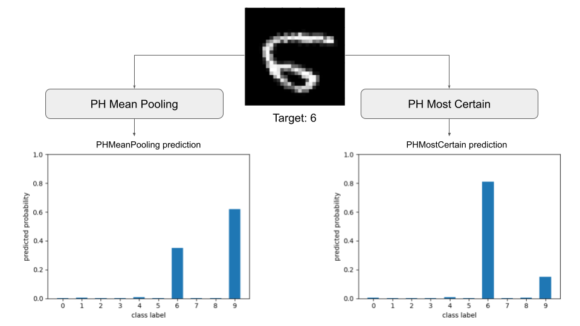
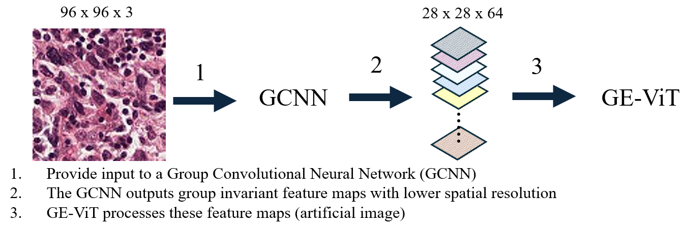

## E(2) Equivariant Vision Transformer

[comment]: <Total blogpost should be a 20 minute read>

### Wouter Bant, Colin Bot, Jasper Eppink, Clio Feng, Floris Six Dijkstra

---
In this blog post, we analyze and evaluate $E(2)$ Equivariant Vision Transformers and propose alternative methods for equivariant attention models discussed in ["E(2)-Equivariant Vision Transformer"](https://proceedings.mlr.press/v216/xu23b.html). The referenced paper introduces a Group-Equivariant Vision Transformer (GE-ViT), an equivariant adaptation of the Vision Transformer (ViT) from ["An Image is Worth 16x16 Words: Transformers for Image Recognition at Scale"](https://arxiv.org/abs/2010.11929) that employs a novel positional encoding for group equivariance.

Specifically, this blog post:
1. Analyze and experiment with the GE-ViT, and reproduce a subset of the original results reported in the paper. Due to computational constraints, reproducing the full experiments was not achievable. Additionally, we conduct alternative experiments and comprehensively discuss the model's strengths and weaknesses.
2. Visualize different intermediate computations such as latent representations and attention maps throughout the layers of equivariant and non-equivariant models to enhance researchers' understanding. 
3. Evaluate existing and novel methods (e.g., [Basu et al. 2022](https://arxiv.org/abs/2210.06475),  [Basu et al. 2023](https://arxiv.org/abs/2305.09900)) to make non-equivariant (attention) models (e.g., [Lippe 2023](https://lightning.ai/docs/pytorch/stable/notebooks/course_UvA-DL/11-vision-transformer.html), [Dosovitskiy et al. 2021](https://arxiv.org/abs/2010.11929)), equivariant in a post-hoc manner by combining predictions of different transformations of the input that reflect inductive biases.
4. Propose and evaluate methods to reduce the computational costs of the GE-ViT as proposed in the paper, while preserving group invariance.

---

## The Importance of Equivariant Models
This section highlights the importance of equivariant models and surveys prior research in various domains, including image processing [Krizhevsky and Ilya 2012](https://proceedings.neurips.cc/paper/2012/hash/c399862d3b9d6b76c8436e924a68c45b-Abstract.html), 3D point cloud analysis [Li, Chen, and Lee 2018](https://openaccess.thecvf.com/content_cvpr_2018/html/Li_SO-Net_Self-Organizing_Network_CVPR_2018_paper.html), chemistry [Faber et al.](https://journals.aps.org/prl/abstract/10.1103/PhysRevLett.117.135502), astronomy [Ntampaka 2016](https://iopscience.iop.org/article/10.3847/0004-637X/831/2/135/meta), and economics [Qin et al. 2022](https://proceedings.neurips.cc/paper_files/paper/2022/hash/730d61b4d9ff794a028fa3a25b9b891d-Abstract-Conference.html). Equivariance ensures that when a transformation is applied to the input, the output undergoes a corresponding transformation, offering geometric guarantees and parameter efficiency due to shared weights across transformations.

Traditional Convolutional Neural Networks (CNNs) exhibit translation equivariance but lack equivariance to rotations in input data. The translation equivariance of CNNs is reached by template matching of the same learnable convolutional kernel shifted over the feature map. The first rotation-equivariant neural network, proposed by [Cohen and Welling 2016](https://proceedings.mlr.press/v48/cohenc16.html), augmented CNNs' translation equivariance by "lifting to the group," incorporating discrete group transformations of the kernel, resulting in a Group Equivariant CNN (G-CNN) equivariant to translations and rotations, specifically to the SE(2) group (roto translation group).

In Natural Language Processing (NLP), [Vaswani et al. 2017](https://proceedings.neurips.cc/paper_files/paper/2017/hash/3f5ee243547dee91fbd053c1c4a845aa-Abstract.html) introduced transformers in 2017, later adapted to computer vision by [dosovitskiy et al. 2020](https://arxiv.org/abs/2010.11929) as vision transformers (ViTs). Despite requiring positional encodings for each patch of pixels, ViTs achieved notable performance but lacked equivariance. [Romero et al. 2020](https://proceedings.mlr.press/v119/romero20a.html) proposed Group Equivariant Stand Alone Self-Attention Networks (GSA-nets), employing novel positional encoding and self-attention mechanisms for group equivariance.

<table align="center">
  <tr align="center">
      <td></td>
  </tr>
  <tr align="left">
    <td colspan=2><b>Figure 1.</b> The effect of rotation on the predicted digit for the GE-ViT and the standard ViT</td>
  </tr>
</table>

Figure 1 highlights the importance of equivariant models. The non-equivariant ViT changes its predictions with input transformations, while the equivariant ViT provides consistent predictions. This consistency is crucial in fields like cell analysis, where orientation-invariant predictions are essential.

--- 

## GE-ViT

We assume readers are familiar with Transformers, the attention mechanism, and modern Vision Transformers. For a quick recap, please refer to the [Appendix](#recap-on-vision-transformers-vits). 

### GE-ViT Architecture
The method proposed by the paper, known as GE-ViT, is a modified version of the GSA-Net model. The structure of GE-ViT/GSA-Net and its attention blocks is visualized in Figure 2. 

<table align="center">
  <tr align="center">
      <td></td>
  </tr>
  <tr align="left">
    <td colspan=2><b>Figure 2.</b> Illustration of GE-ViT and Attention Block </td>
  </tr>
</table>

What is important to note is that this model doesn't use patches like the modern ViT, but applies pixel-wise attention in local neighborhoods around each pixel. This does not become particularly clear from the original paper however this is evident in the provided source code of the GE-ViT paper. The lifting self-attention layer transforms the positional encoding with the group actions. The resulting stack of encodings is applied to each pixel's local neighborhood to compute attention scores. The next section further elaborates on this positional encoding. 

After the lifting layer, the resulting layer normalization is applied and the resulting features are put through a Swish activation function. These features are processed through $N$ attention block layers to refine the feature representations. In these attention blocks, GE self-attention is analogous to the group convolutions of the G-CNN (however the group actions are applied to the positional encodings, not the input itself).

Finally, the global pooling block aggregates features in a transformation-invariant manner across the spatial dimensions. Sum pooling is applied over the spatial dimensions and max pooling over the other group elements. Both of these aggregations are invariant to group transformations (because they are independent of input order). Note that this is inconsistent with what the authors mentioned in their paper, but this was how it was done in the code.

### GE-ViT attention & positional embedding
The novel contribution of the GE-ViT paper is an update of the GSA-Net positional encoding that addresses its group equivariance. This update corrects a minor mathematical error in GSA-Net, leading to a slight modification in the generation of positional encodings. The minor change involved a missing group action in the positional encoding calculation, which was mathematically proven to be crucial for group equivariance.

Because attention is applied on the pixel level and because of the quadratic time complexity of the attention mechanism, it is too computationally expensive to attend to all pixels of the input. Instead, attention in GSA-Nets is only applied to an NxN local neighborhood around each pixel. The attention computation is separated between the rows and columns of the local neighborhood instead of individual pixels to reduce the number of computations (the row and column attention scores are summed after).

To achieve group equivariance, a stack of positional encodings is generated including an encoding for every group element with its corresponding group action applied to the encoding. This is similar to how an input image is processed in a G-CNN lifting layer because it takes a base ‘image’ (encoding in this case) and applies the group action for every group element. In practice, this means that for a discrete E(2) group with 90-degree rotations with flips (8 elements in total), a stack of 8 positional encodings is generated.

This works as follows:

* For every group element, a ‘positional embedding index’ is generated by taking a base NxN embedding and applying the group action corresponding to the element. The split row and column embedding indices are visualized in Figure 3. 

<table align="center">
  <tr align="center">
      <td></td>
  </tr>
  <tr align="center">
      <td></td>
  </tr>
  <tr align="left">
    <td colspan=2><b>Figure 3.</b> Visualisation of the GE-ViT's row and column embedding indices for every group element.</td>
  </tr>
</table>

* The embedding index is put through a learned mini-network with 2 convolutional layers to obtain the final position embeddings. An example of row embedding when transformed by this mini-net is visualized in Figure 4.

<table align="center">
  <tr align="center">
      <td></td>
  </tr>
  <tr align="left">
    <td colspan=2><b>Figure 4.</b> Visualisation of the GE-ViT's learned row embedding for every group element.</td>
  </tr>
</table>

* As previously mentioned, the attention scores for rows and columns in the local neighborhood are calculated separately and summed after. We attempt to visualize the combination of the row and column embeddings in Figure 5.

<table align="center">
  <tr align="center">
      <td></td>
  </tr>
  <tr align="left">
    <td colspan=2><b>Figure 5.</b> Visualisation of the GE-ViT's learned row and column embeddings for a single group element and their combination.</td>
  </tr>
</table>

The final attention mechanism for a pixel in the center of an image is visualized in Figure 6. We can see that within an attention head, the attention is transformed according to the group element’s rotation (hence why the difference between $MHA_0, g_0$ and $MHA_0, g_1$ is a 90-degree rotation). It's important to remember that this computation is done for every pixel in the image, we will come back to this when discussing strengths and weaknesses, as well as potential improvements on the method.

<table align="center">
  <tr align="center">
      <td></td>
  </tr>
  <tr align="left">
    <td colspan=2><b>Figure 6.</b> Visualisation of the GE-ViT's attention mechanism for the center pixel of an image.</td>
  </tr>
</table>

---

## Discussion of ["E(2)-Equivariant Vision Transformer"](https://proceedings.mlr.press/v216/xu23b.html)

While reproducing the proposed architecture from this paper, several aspects stood out. Although the architecture offers clear advantages over GSA-nets and traditional Vision Transformers, it also has notable weaknesses.

[comment]: < Here we say that these methods are computationally expensive and some of our findings. eg steerable but also artifact-like differences (show this with a figure). quickly mention we evaluate on the validation set an increased batch size (and proportionally learning rate) because of computational constraints. Display the results we got for their methods here and say we use the reported numbers of the best method in the following parts of the blog post. >

<strong> Weaknesses and strengths of proposed method </strong>

The original authors claim that their positional encodings result in an E(2) equivariant model, ensuring parameter efficiency and consistent predictions for rotated images, crucial for applications like medical cell analysis. Figure 7 demonstrates the latent representations of inputs transformed by an E(2) group action (rototranslation + mirroring).

<table align="center">
  <tr align="center">
      <td></td>
  </tr>
  <tr align="left">
    <td colspan=2><b>Figure 7.</b> GE-ViT latent representations. </td>
  </tr>
</table>

Equivariant networks benefit from weight sharing and faster generalization, but the authors did not explore this advantage in depth, so we investigated this further in experiments detailed later.

In addition to strengths, we also identified several weaknesses in their approach and methods:

1. The original paper claims that the group equivariant vision transformer significantly outperforms non-equivariant self-attention networks. We question this assertion and suggest that retraining a Vision Transformer to be rotation equivariant post-hoc could significantly enhance performance.

2. A significant weakness of the original GE-VIT lies in its training and inference time. The authors mention using the well-known ViT, which is inaccurate. The original ViT and the GSA-net paper were concurrently published in the same journal. The GE-VIT authors utilized the codebase from GSA-nets, which applies attention to each pixel instead of pixel patches, diverging from the standard vision transformer. This results in slow training and inference times due to the pixel-wise attention's computational demands.

[comment]: <The following is a bit double, so commented out currently: 4. The Vision Transformer in the GSA-Net architecture uses local self-attention for every single pixel which makes the model translation equivariant but also computationally very expensive. The GE-ViT is based on this GSA-Net model, not the well-known original ViT. This can be made more computationally efficient by dividing the images into patches and applying the equivalent things to those patches. Their proposed architecture does calculations with the input of the following size for MNIST and the lifting layer and rotation of 90 degrees. ([8, 9, 4, 28, 28, 9, 9]) = (batch size, num_heads, the 4 rotations, height, width, patch size, patch size) where patch size refers to the local neighborhood that should be taken into account for attention. For a single pixel, it computes attention to 81 different other pixels and then this is done for all 28*28*9*4=28244 pixels making it a total of 81*28244=2,286,144 attention computations just for the lifting layer. Having this much attention to computations causes training and inference time to be slow for even relatively low-resolution images such as MNIST data.>

3. Another issue pertains to the implementation used for training and evaluating the model's performance. Upon inspecting their source code, we found that the authors utilized the test set during training to evaluate their method's performance, reporting the epoch with the best test set performance as the result. This practice risks overfitting on the test set, which should only be used to evaluate the final model's performance, not guide training.

4. The original paper claims that their approach is steerable due to the positional encoding residing in a continuous space, thus avoiding interpolation effects inherent in discrete transformations. However, since the input (an image) is still discrete, outputs for 45-degree and 90-degree rotations will inevitably differ, as visualized in Figure 8 below.

<table align="center">
  <tr align="center">
      <td></td>
  </tr>
  <tr align="left">
    <td colspan=2><b>Figure 8.</b> Illustrate the steerability of the approach. </td>
  </tr>
</table>

In examining the codebase logs of the authors, we observed that the shortest experiment on the smallest dataset took a week. Lacking the computational resources for this, we were unable to fully reproduce their experiments. Nonetheless, when evaluated on the validation set and with increased batch size (and proportionally increased learning rate), we conducted one run for the rotation MNIST dataset with their best-reported model equivariant to 90-degree rotations. This model achieved an accuracy of **96.42%**, significantly lower than the reported **97.58%**, as expected since we did not use the test set for validation. Thus, for the remainder of this blog post, we assume the reported numbers to be correct and report these for comparison. Throughout all experiments, we maintain separate validation and test sets.

[comment]: <How do we want to visualise attention as in the original ViT paper (okey ik ga die paper wel even bestuderen Figure 6 dus kijken)>

## Post Hoc Equivariant Models
### Introduction

Equivariant models provide numerous benefits, yet they are frequently memory-demanding and need extensive training epochs to achieve convergence, limiting their broader adoption. To overcome this challenge, we have expanded on the work of [Basu et al. 2023](https://arxiv.org/abs/2305.09900), enabling any image classification model to become equivariant with little to no fine-tuning. This approach ensures high performance and fast computation, maintaining the computational efficiency of parameter sharing while utilizing pretrained knowledge.

A model is group equivariant if transformations of its input result in a group transformation of its output. [Basu et al. 2023](https://arxiv.org/abs/2305.09900) achieved this by invariantly aggregating the latent dimensions of transformed inputs. In this work, they proposed several methods, including mean pooling and using a neural network to assign importance scores for a weighted average of embeddings. 

Besides these ways of aggregating the embeddings we propose and evaluate the following ways of aggregating the latent dimensions: sum pooling, max pooling, and multi-head attention without positional encodings. Furthermore, we experiment with predicting the class with the highest probability among all transformations and predicting the class with the highest product of probabilities. In the next section, we will more formally discuss these methods.

### Equivariant Embedding Model
To transform a pre-trained non-equivariant model $M$ into an equivariant model $M_G$, our objective is to create $M_G$ such that it maintains equivariance to the actions of a finite group $G$, while minimizing the collective discrepancies between the features $M(gx)$ and $M_G(gx)$ for any $x$, across all $g \in G$. This ensures the preservation of as much pre-trained knowledge from $M$ as possible. We operate under the assumption that the group actions are well-defined.

In our investigation of image classification, we utilize the $C_4$ (90° rotations) and $D_4$ groups (90° rotations and horizontal flips). The reason we chose them is that these groups consistently outperform non-equivariant networks on the CIFAR-10 dataset, as evidenced by [Cohen and Welling 2016](https://arxiv.org/abs/1602.07576).

The $C_4$ group comprises {e, $r$, $r^2$, $r^3$}, where e denotes the identity and $r$ represents a 90° rotation.

Given an image set $X$, the group action of $G$ is applied on $X$ as $\Gamma X$: $G \times X \rightarrow X$. We denote $\Gamma X(g,x)$ as $gx$. A model $M$: $X \rightarrow Y$ is considered equivariant to $G$ under the group action of $G$ on $X$ and $Y$ if $M(gx) = g(M(x))$ for all $g \in G$ and $x \in X$. This implies that any group transformation $g$ applied to the input $\Gamma X(g,x)$ should result in an equivalent transformation of the output $\Gamma Y(gM(x))$.

To convert the non-equivariant model to an equivariant one, we aim to solve the following optimization problem:

$$ \min_{M_G(x)} \sum_{g \in G} ||M(gx) -M_G(gx)||_2^2 $$

subject to:

$$ M_G(gx) = gM_G(x) $$

for all $g \in G$.

To demonstrate the equivariance of the method, we visualize the pipeline for this method in Figure 9. It illustrates how post hoc equivariance works. The input image undergoes various transformations to achieve equivariance (in this case, 90-degree rotations). Each transformed image is processed by the same model, which generates latent embeddings or class probabilities. These embeddings (or probabilities) are then aggregated in an invariant way. Note that the model's latent representations are equivariant to the group (because of the lifting to the group) until they are aggregated, which is done using an invariant operation.

<table align="center">
  <tr align="center">
      <td></td>
  </tr>
  <tr align="left">
    <td colspan=2><b>Figure 9.</b> Pipeline post hoc equivariant models. </td>
  </tr>
</table>

### Aggregation layer
For the final layer, unlike [Basu et al. 2022](https://arxiv.org/abs/2210.06475) who utilized a group-equivariant custom layer for language model compositional generalization in a language-to-action translation context, we seek invariant results for image classification.

For our purposes, we define a model $M$: $X \rightarrow Y$ as invariant to $G$ under the group action of $G$ on $X$ and $Y$ if $M(gx) = M(x)$ for all $g \in G$ and $x \in X$, indicating that the transformation does not impact the output.

Hence, for the final invariant layer, we employ the following methods:
#### Method 1: Combining Embeddings from all Transformation Groups

- $x$: input image.
- $g$: transformation in group $G$.
- $M(x)$: output logits from the original input image $x$.
- $M_G(x)$: transformation-invariant output logits.

**Mean Pooling**: Averaging the logits from all action groups $G$.

$$ M_G(x) = \frac{\sum_{g \in G}{M(gx)}}{|G|} $$

This method resembles [Basu et al. 2022](https://arxiv.org/abs/2210.06475), though they employed the Reynolds operator from [Sturmfels 2008](https://www.math.ens.psl.eu/~benoist/refs/Sturmfels.pdf) with the inverse of the transformation $g^{-1}$ to satisfy $M(gx) = g(M(x))$ as demonstrated by [Yarotsky 2022](https://arxiv.org/abs/1804.10306).

**Max Pooling**: Selecting the highest logit for each element within the vector across all action groups $G$.

$$
[M_G(x)]i = \max_{g \in G} \left( M(gx) \right)_i
$$

**Sum Pooling**: Summing the logits from all action groups $G$.

$$ M_G(x) = \sum_{g \in G}{M(gx)} $$

#### Method 2: Computing Logits for Each Transformation Independently

**Select Most Likely**: Combine by multiplying the probabilities obtained from different input transformations.

$$  M_G(x) = \log \left( \prod_{g \in G}\text{softmax}{(M(gx))} \right) $$

Inspired by Maximum Likelihood Estimation, we predict the class with the highest product of probabilities across various transformations. The rationale is that if all transformations consistently assign high probabilities to the same class, this class is more likely to be correct than a class where some probabilities are close to zero.

**Select Most Certain**: Select the outputs for the transformation that assigns the highest probability to some class.

$$  M_G(x) = M ((\text{arg max}_{g \in G} (\max{(\text{softmax}{(M(gx))})}))x) $$

The T transformations all output C probabilities. You look for the largest of these T*C probabilities and use the C outputs from the transformation that provided this probability. The idea is that the model can be uncertain about some less frequently observed transformations during training and assigns a high probability to the correct class for transformations more common in the training data.

#### Method 3: Utilizing External Model within Aggregation

**Learned Weighted Average**: Incorporating significance weight with mean pooling.

Since features $M(gx)$ derived from a fixed $x$ within a pretrained model $M$ are not uniformly crucial across all transformations $g \in G$, we incorporate significance weight with the embedding. After obtaining the embedding for each transformation, we pass the embedding through a simple fully connected neural network to predict weights from input feature vectors, leveraging a linear transformation and GELU activation for effective learning. Additionally, we normalize the weights so that the sum for all embeddings is 1.

Let $λ(gx)$ denote the significance weight assigned to feature $M(gx)$ for $g \in G$, $x \in X$. Inspired by [Basu et al. 2023](https://arxiv.org/abs/2305.09900), though with the goal of invariance, assuming a finite $G$, $λ : X → R^+$ is predefined. 

$$ M_G(x) = \sum_{g \in G}^{|G|}λ(gx)M(gx) \frac{1}{\sum_{g \in G}{λ(gx)}}$$

**Learned Attention Aggregation**: Aggregating with multi-headed attention. 

$$ M_G(x) = \text{MHA}(\cup_{g \in G}M(gx)), g\in G $$

Here, each latent embedding, M(gx), is provided as a separate input to a multi-headed attention (MHA) block. MHA is permutation invariant for constant positional encoding, thus we can invariantly aggregate the latent embeddings when we provide no positional encoding and take the final embedding of the CLS vector as the aggregated embedding. This is exactly what we did and, like in most of our other approaches, this CLS vector is now projected to logits with the original last layer.

To demonstrate the equivariance of this mechanism, we visualize the behavior of attention inside the model when the input transforms. In Figure 10, for an image rotated and flipped in 8 ways, we observe how the CLS token attends across MHA blocks. Notice how the CLS token attends to different columns, representing different transformed input embeddings, for each transformation.

<table align="center">
  <tr align="center">
      <td></td>
  </tr>
  <tr align="left">
    <td colspan=2><b>Figure 10.</b> Self-attention weights in the Learned Attention Aggregation for input transformed by various group actions.</td>
  </tr>
</table>

While equivariance is used in intermediate steps to process and aggregate transformed embeddings, the final classification output remains invariant. The CLS token embedding captures essential features across all transformations, ensuring consistent predictions. Passed through an MLP, the CLS token produces invariant classification logits, unaffected by input transformations.

### Results
We evaluated all approaches through various experiments, examining their zero-shot impact, the effect of fine-tuning only the last layer, and the impact of fine-tuning the entire model.

We conducted the following experiments: 
1. Training and evaluating on the full rotation MNIST dataset. We used a ViT pretrained on MNIST for the latent embeddings. This was done to compare our novel methods to GE-ViT.
2. Training on the full standard MNIST dataset and evaluating on the full rotation MNIST dataset. We used the same model as the first experiment. This was done to prove that the models were group equivariant, even when trained on a dataset that didn't include samples that were transformed by the group action.
3. Training on 10% of rotation MNIST and evaluating on the full rotation MNIST dataset with the same model as in the first experiment. This assessed the data efficiency of the models.
4. Evaluating a pretrained RESNET-50 on Patch Camelyon. This was done to compare our novel methods to GE-ViT, and because we deemed Patch Camelyon to be more interesting than MNIST in terms of its real-life relevance.

For the experiments on MNIST or rotation MNIST, we rotate the input 16 times. For Patch Camelyon we rotate 4 times and additionally flip these transformations (providing 8 different inputs to the model). For fine-tuning, we use the same learning rate as training the normal ViT to ensure that improvements are solely from the proposed method and not from fine-tuning the pretrained model.

> **NOTE:** Links to all relevant code and markdowns for reproducing our results are provided in the [Experimental Details](#experimental-details) section.

#### 1. Training and evaluating on the full rotation MNIST dataset
In the first experiment, we trained and evaluated on rotation MNIST as done in [GE-ViT](https://arxiv.org/abs/2306.06722) and [GSA-Nets](https://arxiv.org/abs/2010.00977). Below are the reported test accuracies of the best models, obtained with a patch size of 5 and 12 rotations.

<table align="center">
<thead>
<tr>
<th align="center">Model</th>
<th align="center">Best Reported Test Accuracy</th>
</tr>
</thead>
<tbody>
<tr>
<td align="center">GSA - Nets</td>
<td align="center">97.97</td>
</tr>
<tr>
<td align="center">GE-ViT</td>
<td align="center">98.01</td>
</tr>
</tbody>
</table>

In the table below we show the results of a normal ViT and one where we used the common approach of test time augmentation (TTA), where we use mean pooling over the logits over different image transformations. Note that these transformations are the same for our post hoc methods. We show these numbers for all experiments as the idea is similar, however fine-tuning the last layer or entire model doesn't make sense when merely aggregating the model's outputs.

<table  align="center">
<thead>
<tr>
<th  align="center">Model</th>
<th  align="center">Validation Accuracy</th>
<th  align="center">Test Accuracy</th>
</tr>
</thead>
<tbody>
<tr>
<td  align="center">Normal ViT</td>
<td  align="center">97.55</td>
<td  align="center">97.23</td>
</tr>
<tr>
<td  align="center">Normal ViT + TTA</td>
<td  align="center">97.90</td>
<td  align="center">98.09</td>
</tr>
</tbody>
</table>

Below we present the results for the different aggregation methods without fine-tuning, with fine-tuning the last layer, and with fine-tuning the entire model.

<table align="center">
    <thead>
        <tr>
            <th></th>
            <th colspan = 2>No fine-tuning</th>
            <th colspan = 2>Fine-tuning last layer</th>
            <th colspan = 2> Model fine-tuning </th>
        </tr>
        <tr>
            <th>Model</th>
            <th align="center">Validation Accuracy</th>
            <th align="center">Test Accuracy</th>
            <th >Validation Accuracy</th>
            <th >Test Accuracy</th>
            <th >Validation Accuracy</th>
            <th >Test Accuracy</th>
        </tr>
    </thead>
    <tbody>
<tr>
<td>PH Mean Pooling</td>
<td align="center">98.00</td>
<td align="center">98.07</td>
<td align="center">98.20</td>
<td align="center">98.20</td>
<td align="center">98.70</td>
<td align="center">98.24</td>
</tr>
<tr>
<td>PH Max Pooling</td>
<td align="center">97.80</td>
<td align="center">97.82</td>
<td align="center">98.10</td>
<td align="center">98.12</td>
<td align="center">98.65</td>
<td align="center">98.31</td>
</tr>
<tr>
<td>PH Sum Pooling</td>
<td align="center">98.00</td>
<td align="center">98.07</td>
<td align="center">98.20</td>
<td align="center">98.20</td>
<td align="center">98.70</td>
<td align="center">98.24</td>
</tr>
<tr>
<td>PH Most Likely</td>
<td align="center">97.90</td>
<td align="center">98.09</td>
<td align="center">98.15</td>
<td align="center">98.14</td>
<td align="center">98.45</td>
<td align="center">98.18</td>
</tr>
<tr>
<td>PH Most Certain</td>
<td align="center">97.75</td>
<td align="center">97.63</td>
<td align="center">97.95</td>
<td align="center">97.94</td>
<td align="center">98.40</td>
<td align="center">98.10</td>
</tr>
<tr>
<td>PH Learned Weighted Average</td>
<td align="center">96.60</td>
<td align="center">96.46</td>
<td align="center">95.65</td>
<td align="center">95.48</td>
<td align="center">96.60</td>
<td align="center">96.46</td>
</tr>
<tr>
<td>PH Learned Attention Aggregation</td>
<td align="center">96.80</td>
<td align="center">96.75</td>
<td align="center">96.65</td>
<td align="center">96.33</td>
<td align="center">96.80</td>
<td align="center">96.75</td>
</tr>
    </tbody>
</table>

The table above presents interesting results on many accounts. Firstly, except for methods requiring learning, all approaches enhance the results from the base model. This is unexpected, as modifying the embeddings seen by the final layer during training—such as summing or selecting the maximum element—would typically alter them significantly. Nonetheless, the final layer adeptly projects these modified embeddings to logits, where the highest value corresponds to the target label.

Second, as anticipated, fine-tuning the last layer generally yields better results, with further enhancements observed when fine-tuning the entire model. Notably, several models surpass the best-reported baselines from GE-ViT, even with only the final layer fine-tuned. Moreover, all models employing aggregation without additional parameters outperform the baselines when fine-tuning the entire model. This indicates that superior results can be achieved without inherently equivariant models, highlighting the significance of post hoc augmentations in this experiment.

However, we observed that in this experiment, learning to score the embeddings or learning to aggregate the embeddings with multi-head attention led to overfitting, resulting in decreased validation and test accuracies.

Finally, when comparing the results of TTA with mean pooling we see that our methods that don't learn to aggregate the embeddings are comparable in terms of performance when we don't fine-tune, however, with fine-tuning these methods are superior.
 
#### 2. Training on the full standard MNIST dataset and evaluating on the full rotation MNIST dataset
One of the advantages of purely equivariant models is that the training data can be in different orientations than the test data, as long as the transformations between the training and testing examples are within the group the model is equivariant to. This is typically not the case for non-equivariant models. Therefore, we now test how well post hoc methods can improve the performance of non-equivariant models.

<!---  TODO check this, this number seems to low
<table align="center">
<thead>
<tr>
<th align="center">Model</th>
<th align="center">Test Accuracy (we obtained)</th>
</tr>
</thead>
<tbody>
<tr>
<td align="center">GE-ViT</td>
<td align="center">83.41</td>
</tr>
</tbody>
</table>
--->

<table align="center">
<thead>
<tr>
<th align="center">Model</th>
<th align="center">Validation Accuracy</th>
<th align="center">Test Accuracy</th>
</tr>
</thead>
<tbody>
<tr>
<td align="center">Normal ViT</td>
<td align="center">29.75</td>
<td align="center">28.72</td>
</tr>
<tr>
<td align="center">Normal ViT + TTA</td>
<td align="center">40.65</td>
<td align="center">40.72</td>
</tr>
</tbody>
</table>

<table align="center">
    <thead>
        <tr>
            <th></th>
            <th colspan = 2>No fine-tuning</th>
            <th colspan = 2>Fine-tuning last layer</th>
            <th colspan = 2> Model fine-tuning </th>
        </tr>
        <tr>
            <th>Model</th>
            <th >Validation Accuracy</th>
            <th >Test Accuracy</th>
            <th >Validation Accuracy</th>
            <th >Test Accuracy</th>
            <th >Validation Accuracy</th>
            <th >Test Accuracy</th>
        </tr>
    </thead>
    <tbody>
<tr>
<td>PH Mean Pooling</td>
<td align="center">43.50</td>
<td align="center">43.31</td>
<td align="center">84.90</td>
<td align="center">85.50</td>
<td align="center">97.40</td>
<td align="center">97.53</td>
</tr>
<tr>
<td>PH Max Pooling</td>
<td align="center">41.65</td>
<td align="center">41.89</td>
<td align="center">86.75</td>
<td align="center">87.13</td>
<td align="center">97.35</td>
<td align="center">97.28</td>
</tr>
<tr>
<td>PH Sum Pooling</td>
<td align="center">43.50</td>
<td align="center">43.31</td>
<td align="center">84.90</td>
<td align="center">85.50</td>
<td align="center">97.40</td>
<td align="center">97.53</td>
</tr>
<tr>
<td>PH Most Likely</td>
<td align="center">30.05</td>
<td align="center">29.30</td>
<td align="center">74.32</td>
<td align="center">72.91</td>
<td align="center">76.89</td>
<td align="center">75.47</td>
</tr>
<tr>
<td>PH Most Certain</td>
<td align="center">47.95</td>
<td align="center">49.00</td>
<td align="center">82.95</td>
<td align="center">82.52</td>
<td align="center">96.30</td>
<td align="center">96.26</td>
</tr>
<tr>
<td>PH Learned Weighted Average</td>
<td align="center">83.80</td>
<td align="center">83.28</td>
<td align="center">87.35</td>
<td align="center">87.00</td>
<td align="center">94.90</td>
<td align="center">94.99</td>
</tr>
<tr>
<td>PH Learned Attention Aggregation</td>
<td align="center">92.75</td>
<td align="center">92.43</td>
<td align="center">92.75</td>
<td align="center">92.41</td>
<td align="center">96.65</td>
<td align="center">96.16</td>
</tr>
    </tbody>
</table>

The non-equivariant model trained on MNIST achieved an accuracy of approximately **29%** on the rotation MNIST dataset. While proficient at predicting digits in their normal orientation, the model struggles with heavily rotated images. The most effective approach without learning involves selecting the transformation yielding the highest probability for a specific class, resulting in a test accuracy of **49%**. This can be attributed to the model's uncertainty regarding unseen transformations during training, yet it assigns high probability to digits close to their original orientation.

Interestingly, models that require learning perform much better in this experiment. Aggregating the embeddings with multi-head attention even leads to an accuracy of about **92%** while keeping all parameters of the original model fixed. However, similar to the previous results, when fine-tuning the entire model, averaging or summing the embeddings proves more effective.

Furthermore, mean pooling of the latent dimensions works in this experiment much better than averaging the logits as is done with TTA. This shows that beyond the ability to fine-tune the model upon incorporating inductive biases, our approach is superior when limited data is available.

Another interesting insight is the behavior of the MostLikely model with input rotated to resemble another number (e.g., a vertically flipped 6 resembling a 9). It performs well in these edge cases, often assigning a higher probability to the correct class. One such instance is visualized in Figure 11.

<table align="center">
  <tr align="center">
      <td></td>
  </tr>
  <tr align="left">
    <td colspan=2><b>Figure 11.</b> Comparing predicted probabilities from the MeanAggregation and MostLikely post hoc equivariant transformer models in an edge case where a 6 is rotated to possibly be confused with a 9.</td>
  </tr>
</table>

#### 3. Training on 10% of rotation MNIST and evaluating on the full rotation MNIST dataset
One key advantage of equivariant models is their data efficiency, stemming from the incorporation of inductive biases. Therefore, we now compare the performance of post hoc methods against the equivariant [GE-ViT](https://arxiv.org/abs/2306.06722) when trained on only 10% of the rotated MNIST dataset.

<table align="center">
<thead>
<tr>
<th align="center">Model</th>
<th align="center">Best Reported Test Accuracy</th>
</tr>
</thead>
<tbody>
<tr>
<td align="center">GE-ViT</td>
<td align="center">83.55</td>
</tr>
</tbody>
</table>

We also evaluated the performance of GE-ViT when trained on a reduced dataset comprising only 10% of the total data. Interestingly, this model reached convergence after 600 epochs, achieving a test accuracy of only **83.55%**. However, this accuracy was notably lower compared to the model trained on the complete training set.

<table align="center">
<thead>
<tr>
<th align="center">Model</th>
<th align="center">Validation Accuracy</th>
<th align="center">Test Accuracy</th>
</tr>
</thead>
<tbody>
<tr>
<td align="center">Normal ViT</td>
<td align="center">86.25</td>
<td align="center">86.21</td>
</tr>
<tr>
<td align="center">Normal ViT + TTA</td>
<td align="center">88.60</td>
<td align="center">89.03</td>
</tr>
</tbody>
</table>

<table align="center">
    <thead>
        <tr>
            <th></th>
            <th colspan = 2>No fine-tuning</th>
            <th colspan = 2>Fine-tuning last layer</th>
            <th colspan = 2> Model fine-tuning </th>
        </tr>
        <tr>
            <th>Model</th>
            <th >Validation Accuracy</th>
            <th >Test Accuracy</th>
            <th >Validation Accuracy</th>
            <th >Test Accuracy</th>
            <th >Validation Accuracy</th>
            <th >Test Accuracy</th>
        </tr>
    </thead>
    <tbody>
<tr>
<td>PH Mean Pooling</td>
<td align="center">88.50</td>
<td align="center">89.00</td>
<td align="center">88.75</td>
<td align="center">89.20</td>
<td align="center">89.30</td>
<td align="center">89.73</td>
</tr>
<tr>
<td>PH Max Pooling</td>
<td align="center">88.15</td>
<td align="center">88.73</td>
<td align="center">88.40</td>
<td align="center">88.96</td>
<td align="center">88.90</td>
<td align="center">89.41</td>
</tr>
<tr>
<td>PH Sum Pooling</td>
<td align="center">88.50</td>
<td align="center">88.99</td>
<td align="center">88.75</td>
<td align="center">89.20</td>
<td align="center">89.30</td>
<td align="center">89.73</td>
</tr>
<tr>
<td>PH Most Likely</td>
<td align="center">88.60</td>
<td align="center">89.03</td>
<td align="center">88.90</td>
<td align="center">89.12</td>
<td align="center">86.75</td>
<td align="center">87.19</td>
</tr>
<tr>
<td>PH Most Certain</td>
<td align="center">87.10</td>
<td align="center">87.88</td>
<td align="center">87.75</td>
<td align="center">88.34</td>
<td align="center">88.50</td>
<td align="center">88.87</td>
</tr>
<tr>
<td>PH Learned Weighted Average</td>
<td align="center">80.30</td>
<td align="center">80.75</td>
<td align="center">78.95</td>
<td align="center">79.10</td>
<td align="center">81.85</td>
<td align="center">82.27</td>
</tr>
<tr>
<td>PH Learned Attention Aggregation</td>
<td align="center">82.25</td>
<td align="center">82.66</td>
<td align="center">82.15</td>
<td align="center">82.63</td>
<td align="center">84.50</td>
<td align="center">84.44</td>
</tr>
    </tbody>
</table>

Consistent with our findings on the full rotation MNIST dataset, we found that learning to aggregate embeddings resulted in overfitting. In contrast, other methods consistently enhanced performance. Also, the performance of TTA is similar when not fine-tuning but also here fine-tuning led to significant improvements, and both mean pooling and summing of latent dimensions achieved the highest accuracies. Notably, our non-equivariant ViT already outperformed the GE-ViT. Throughout our experiments, the GE-ViT showed high sensitivity to minor hyperparameter changes. We hypothesize that optimizing these hyperparameters could potentially yield higher accuracy. However, due to computational constraints, we did not explore this further.

#### 4. Evaluating a pretrained RESNET-50 on Patch Camelyon
Until now, our analysis has been limited to models trained exclusively on either MNIST or rotation MNIST. However, it's worth noting that the post hoc methods discussed can be applied to pretrained models trained on various datasets. To validate the robustness of our findings, we use a [trained RESNET-50 model](https://huggingface.co/1aurent/resnet50.tiatoolbox-pcam) provided by [TIAToolbox](https://tia-toolbox.readthedocs.io/en/latest/?badge=latest) as we found it challenging to locate well-performing models elsewhere.

<table align="center">
<thead>
<tr>
<th align="center">Model</th>
<th align="center">Best Reported Test Accuracy</th>
</tr>
</thead>
<tbody>
<tr>
<td align="center">GSA - Nets</td>
<td align="center">82.26</td>
</tr>
<tr>
<td align="center">GE-ViT</td>
<td align="center">83.82</td>
</tr>
</tbody>
</table>

 
<table align="center">
<thead>
<tr>
<th align="center">Model</th>
<th align="center">Validation Accuracy</th>
<th align="center">Test Accuracy</th>
</tr>
</thead>
<tbody>
<tr>
<td align="center">Normal ViT</td>
<td align="center">87.76</td>
<td align="center">86.61</td>
</tr>
<tr>
<td align="center">Normal ViT + TTA</td>
<td align="center">88.07</td>
<td align="center">87.23</td>
</tr>
</tbody>
</table>

<table align="center">
    <thead>
        <tr>
            <th>Model</th>
            <th colspan = 2>No fine-tuning</th>
            <th colspan = 2>fine-tuning</th>
        </tr>
        <tr>
            <th></th>
            <th >Validation Accuracy</th>
            <th >Test Accuracy</th>
            <th >Validation Accuracy</th>
            <th >Test Accuracy</th>
        </tr>
    </thead>
    <tbody>
<tr>
<td>PH Mean Pooling</td>
<td align="center">88.07</td>
<td align="center">87.27</td>
<td align="center">90.40</td>
<td align="center">87.52</td>
</tr>
<tr>
<td>PH Max Pooling</td>
<td align="center">86.67</td>
<td align="center">86.15</td>
<td align="center">90.08</td>
<td align="center">86.94</td>
</tr>
<tr>
<td>PH Sum Pooling</td>
<td align="center">88.29</td>
<td align="center">87.43</td>
<td align="center">90.33</td>
<td align="center">87.15</td>
</tr>
<tr>
<td>PH Most Likely</td>
<td align="center">88.07</td>
<td align="center">87.27</td>
<td align="center">90.37</td>
<td align="center">87.14</td>
</tr>
<tr>
<td>PH Most Certain</td>
<td align="center">87.90</td>
<td align="center">87.11</td>
<td align="center">90.04</td>
<td align="center">86.98</td>
</tr>
    </tbody>
</table>

We assessed the pretrained model's performance on PCam's validation and test sets, revealing accuracies of **87.8%** and **86.6%** respectively. Remarkably, employing mean pooling boosted these accuracies to **90.4%** and **87.5%** through just 1 epoch of fine-tuning. This could be attributed to the mean pooling equation minimizing the distance between features obtained by a pretrained model and the equivariant model more effectively compared to the other two methods. Additionally, both summing and the most likely method yielded favorable results in this experiment, highlighting the efficacy of incorporating inductive biases into pretrained models to enhance performance.

A notable observation is the substantial gap between validation and test accuracies. Despite employing a single-epoch fine-tuning approach on the training set, it's puzzling why the validation accuracy would differ significantly from the test accuracy. Similar trends were observed in other PCam experiments, where models exhibited rapid validation accuracy growth but more subdued improvements on the test set. Further investigation of this dataset is encouraged as it is widely used as a benchmark.

Furthermore, our findings demonstrate the superiority of large models over GSA-nets and GE-ViTs. However, it's crucial to acknowledge the parameter discrepancy, comparing models with 45,000 parameters to one of 23.6 million. Attempting to scale up GE-ViTs to over 500,000 parameters was not feasible for us, exceeding the limitations of our 40GB RAM GPU with a batch size of 1. While this indicates poor scalability, it's worth exploring how these models perform when scaled up, given our evidence that integrating inductive biases significantly enhances performance.

## Speeding up GE-ViT
#### Introduction
GSA-Nets and GE-ViTs are slow because attention is applied on the pixel level. We propose two methods to reduce the spatial resolution of the input to GE-ViT which we dub the artificial image. 

The first approach is to split the image into patches that are lifted to the group. Subsequently, each transformation is projected and the resulting embeddings are averaged over the group producing an embedding for the patch. The image structure is preserved, but the artificial image contains the embeddings for the patches with dimensionality 64. This pipeline is visualized in Figure 12 below:

<table align="center">
  <tr align="center">
      <td></td>
  </tr>
  <tr align="left">
    <td colspan=2><b>Figure 12.</b> Pipeline for creating an artificial image composed of group invariant patch embeddings. </td>
  </tr>
</table>

> Similar to the normal ViT, we create patches, but these are lifted to the group, and the resulting transformations are processed by the same model. Subsequently, the images are aggregated over the group and reshaped to retain the original image structure, albeit with fewer pixels. The resulting artificial image is then fed to GE-ViT as usual.

The second method involves processing the image with a group convolutional neural network, without padding, leading to a natural decrease in spatial resolution. In this approach, the output comprises 32 E(2) invariant feature maps with a spatial resolution of 28 by 28. This stack of feature maps serves as the artificial image for GE-ViT. This process is depicted in Figure 13:

<table align="center">
  <tr align="center">
      <td></td>
  </tr>
  <tr align="left">
    <td colspan=2><b>Figure 13.</b> Pipeline for creating an artificial image composed of group invariant feature maps from a G-CNN. </td>
  </tr>
</table>

> The image is processed with a G-CNN that provides group-invariant feature maps. These feature maps have lower spatial resolution and are the input to GE-ViT.

#### Results

##### Approach 1: projecting patches to group invariant embeddings
Because of computational constraints we train on 1 percent of Patch Camelyon for 50 epochs and report the accuracy after 50 epochs on 10% of the test data. Therefore, the results in this section serve as indicators rather than conclusive evidence.

<table align="center">
  <tr align="center">
      <td></td>
  </tr>
  <tr align="left">
    <td colspan=2><b>Figure 14.</b> Accuracy vs. epoch time for different patch sizes. </td>
  </tr>
</table>

> Decreasing the spatial dimension of the input significantly reduces training time but also results in a performance decrease compared to GE-ViT.

The results of this experiment are visualized in Figure 14. First, it can be observed that increasing the patch size decreases training time significantly. This is because reducing the spatial resolution decreases the number of computations by GE-ViT. Second, we observe the optimal patch size, in terms of accuracy, is 6. Smaller patch sizes likely split tumor cells making the classification more challenging. Larger patch sizes can likely not be represented well with a 64-dimensional embedding obtained from a linear projection. 

If our hypothesis holds, this highlights a drawback of using modern ViT, which employs patches, for specific applications where a few pixels determine the image label, as in the detection of pathological cells. This concept is illustrated in Figure 15, where black arrows denote tumor cell infiltration ([image courtesy](https://www.researchgate.net/publication/337826655_WSZG_inhibits_BMSC-induced_EMT_and_bone_metastasis_in_breast_cancer_by_regulating_TGF-b1Smads_signaling)).

<table align="center">
  <tr align="center">
      <td></td>
  </tr>
  <tr align="left">
    <td colspan=2><b>Figure 15.</b> Metastatic tissue, black arrows indicate tumor cell infiltration. </td>
  </tr>
</table>

> The image above is not part of the Patch Camelyon dataset, however, is indicative of the difficulty. For the Patch Camelyon dataset, it holds that ["A positive label indicates that the center 32x32px region of a patch contains at least one pixel of tumor tissue"](https://github.com/basveeling/pcam/tree/master?tab=readme-ov-file#details).

##### Approach 2: downsizing image with G-CNN

In the previous section, we discussed the limitations of using patches. As an alternative, we explored downsizing the image using a G-CNN. We tested various approaches, starting with letting the spatial resolution decrease naturally through group convolutions. However, to achieve the necessary speed, we had to reduce the spatial resolution of Patch Camelyon from 96 to below 32. Using many convolutions with small kernels (3x3 or 5x5) complicated the optimization, making it difficult to find effective hyperparameters. Fewer convolutions with larger kernels (20x20) resulted in poor performance.

We then opted for pooling. Initially, we tried mean pooling, which also yielded poor results. Surprisingly, reducing the spatial dimensions using eight consecutive convolutions with a 5x5 kernel, followed by reducing the resulting 64 spatial dimensions to only 6 with pooling worked best. More convolutions and retaining more spatial dimensions with pooling both made the optimization process harder. The G-CNN output contained 8 channels, which reduced accuracy only slightly, and adding more channels did not improve accuracy but slowed the model significantly.

The resulting model is more than 20 times faster (11 minutes per epoch) than the GE-ViT equivariant to 4 rotations and achieves a test accuracy of **83.96%**, surpassing the best-reported accuracy of **83.82%** achieved by the GE-ViT equivariant to 8 rotations, which was too computationally intensive for our hardware. Additionally, our model was trained for just 15 epochs, whereas the best GE-ViT required 300 epochs. Thus, we achieved better performance in 5% of the epochs while using a model approximately 40 times faster. Additionally, when we fine-tuned for 2 more epochs, our model attained a test accuracy of **84.62%**. We believe that longer training with a lower learning rate and lower batch size can significantly boost performance of our model.

Still, 90% of the computation time is due to operations in the GE-ViT. To test its importance, we replaced the model with a linear layer, significantly speeding up the model but achieving only a test accuracy of **80.42%**. Given that G-CNNs alone can achieve test accuracies north of **87%** ([Bekkers, E. (2019)](https://openreview.net/forum?id=H1gBhkBFDH)), we believe it is worthwhile to further explore the performance of these models when combined with an (equivariant) ViT.

## Concluding Remarks
In this blog post, we thoroughly evaluated existing equivariant methods such as the GE-ViT, and proposed new approaches to achieve equivariance in pretrained models. Our findings highlight mean pooling of latent dimensions as the most reliable method, consistently delivering strong performance across all experiments. We observed significant performance gains by fine-tuning the last layer, with further enhancements when fine-tuning the entire model. Most approaches outperform the well-known method of TTA with mean pooling after fine-tuning the final layer and/or the entire model. This simple yet effective approach notably outperforms equivariant attention models in terms of accuracy, while being significantly less computationally expensive.

It's crucial to note that this approach only confers equivariance to global transformations. As the pretrained models lacked translation equivariance, the final models are also not translation equivariant, exhibiting unique equivariance only to the O(2) or SO(2) groups. However, applying these methods to inherently translation-equivariant CNNs would yield unique equivariance to the E(2) or SE(2) groups. We encourage researchers to explore the effectiveness of these methods when applied to CNNs and diverse datasets. Additionally, we discuss potential future research in the [Appendix](#Appendix).

Furthermore, we investigated downsizing the image via (1) patch projection and (2) downsizing with a G-CNN. Both approaches significantly increase the speed of the models and the second approach improved the GE-ViT in terms of accuracy. We believe that with the right architecture and learning paradigm the second approach can become competitive with SOTA approaches as this is also the case for their non-equivariant counterparts for non-equivariant image classification ([Graham, B, et. al.](https://arxiv.org/abs/2104.01136)). Notably, both approaches lack full translation equivariance. For the second method, this is because of the aggressive max pooling reducing the spatial dimensions from 64 to 6.

We firmly believe that true equivariant models hold promise for superior performance, requiring less data, especially with ample computational resources. However, in scenarios with limited computational resources for training, the post hoc methods presented here offer a practical solution. They can be directly applied to pretrained models, robustly enhancing performance by significant margins.

## Experimental Details

Because of the amount of experiments we conducted, it is not practical to make an extensive list of hyperparameters and design choices. We refer anyone interested directly to our code.

#### Results GE-ViT:
- [Reproduction](src/README.md)

#### Post Hoc Experiments:
- [Implementation of the various methods](src/post_hoc_equivariance/post_hoc_equivariant.py)
- [Implementation of the sub-models used for learned aggregation](src/post_hoc_equivariance/sub_models.py)
- [Most experiments](src/post_hoc_equivariance/post_hoc_experiments.py)
- [Experiments for the pretrained Resnet](src/post_hoc_equivariance/resnet.py)
- [Training for the non-equivariant ViT on rotation MNIST](src/post_hoc_equivariance/train_vit.py)
- [Training for the non-equivariant ViT on normal MNIST](src/post_hoc_equivariance/mnist.py)
- [Reproduction](src/post_hoc_equivariance/README.md)

#### Learned downsizing of image:
- [Experiments + implementation for patches](src/modern_eq_vit/eq_modern_vit.py)
- [Implementation G-CNN](src/models/gcnn.py)
- [Implementation hybrid model (G-CNN + GE-ViT)](src/models/hybrid.py)
- [Reproduction](src/modern_eq_vit/README.md)

## Individual contributions

Wouter Bant:
Came up with and implemented the post hoc methods and the projection of patches for reduced image resolution. Wrote and made pictures for the experiments and conclusion sections. Found a working architecture and hyperparameters for all experiments and oversaw the running of the experiments.

Colin Bot:
Worked mostly on inspecting and visualizing the GE-ViT inner workings. Implemented code for most model interpretability figures and wrote the section on GE-VIT's equivariant positional embedding. 

Jasper Eppink:
Contributed mainly to the writing of the blogpost. Has written the introduction, the recap, and the weaknesses. Also aided with thinking about the programming challenges and the novelties that we wanted to research. Lastly, he was responsible for some visualizations regarding the effect of equivariance.

Clio Feng:
Worked mostly on investigating the equivariant and invariant properties of the post-hoc method from relevant research and wrote the section on post-hoc method. Implemented the code for including training on MNIST and on a fraction of the dataset and wrote the GE-ViT architecture section. Help with the overall blogpost.

Floris Six Dijkstra:
Came up with and implemented the method of downsizing the image with a G-CNN. Came up with testing models performance trained on normal MNIST. Helped with early orientation into post-hoc methods.

## References

<!-- https://proceedings.mlr.press/v216/xu23b.html
https://arxiv.org/abs/2210.06475
https://arxiv.org/abs/2305.09900
https://lightning.ai/docs/pytorch/stable/notebooks/course_UvA-DL/11-vision-transformer.html
https://arxiv.org/pdf/2010.11929
https://proceedings.neurips.cc/paper/2012/hash/c399862d3b9d6b76c8436e924a68c45b-Abstract.html
https://openaccess.thecvf.com/content_cvpr_2018/html/Li_SO-Net_Self-Organizing_Network_CVPR_2018_paper.html
https://journals.aps.org/prl/abstract/10.1103/PhysRevLett.117.135502
https://iopscience.iop.org/article/10.3847/0004-637X/831/2/135/meta
https://proceedings.neurips.cc/paper_files/paper/2022/hash/730d61b4d9ff794a028fa3a25b9b891d-Abstract-Conference.html
https://proceedings.mlr.press/v48/cohenc16.html
https://proceedings.neurips.cc/paper_files/paper/2017/hash/3f5ee243547dee91fbd053c1c4a845aa-Abstract.html
https://proceedings.mlr.press/v119/romero20a.html
https://proceedings.mlr.press/v216/xu23b.html
https://arxiv.org/abs/1602.07576
https://www.math.ens.psl.eu/~benoist/refs/Sturmfels.pdf
https://arxiv.org/abs/1804.10306
https://arxiv.org/abs/2306.06722
https://arxiv.org/abs/2010.00977
https://huggingface.co/1aurent/resnet50.tiatoolbox-pcam
https://tia-toolbox.readthedocs.io/en/latest/?badge=latest
https://www.researchgate.net/publication/337826655_WSZG_inhibits_BMSC-induced_EMT_and_bone_metastasis_in_breast_cancer_by_regulating_TGF-b1Smads_signaling
https://github.com/basveeling/pcam/tree/master?tab=readme-ov-file#details
https://openreview.net/forum?id=H1gBhkBFDH
https://arxiv.org/abs/2104.01136
 -->

- Xu, R., Yang, K., Liu, K., & He, F. (2023, July 2). $E(2)$-Equivariant Vision Transformer. PMLR. https://proceedings.mlr.press/v216/xu23b.html
- Basu, S., Sattigeri, P., Ramamurthy, K. N., Chenthamarakshan, V., Varshney, K. R., Varshney, L. R., & Das, P. (2022, October 13). Equi-Tuning: group equivariant Fine-Tuning of pretrained models. arXiv.org. https://arxiv.org/abs/2210.06475
- Basu, S., Katdare, P., Sattigeri, P., Chenthamarakshan, V., Driggs-Campbell, K., Das, P., & Varshney, L. R. (2023, May 17). Efficient Equivariant Transfer Learning from Pretrained Models. arXiv.org. https://arxiv.org/abs/2305.09900
- Tutorial 11: Vision Transformers — PyTorch Lightning 2.2.5 documentation. (n.d.). https://lightning.ai/docs/pytorch/stable/notebooks/course_UvA-DL/11-vision-transformer.html
- Dosovitskiy, A., Beyer, L., Kolesnikov, A., Weissenborn, D., Zhai, X., Unterthiner, T., Dehghani, M., Minderer, M., Heigold, G., Gelly, S., Uszkoreit, J., & Houlsby, N. (2020, October 22). An Image is Worth 16x16 Words: Transformers for Image Recognition at Scale. arXiv.org. https://arxiv.org/abs/2010.11929
- Krizhevsky, A., Sutskever, I., & Hinton, G. E. (2012). ImageNet Classification with Deep Convolutional Neural Networks. https://proceedings.neurips.cc/paper/2012/hash/c399862d3b9d6b76c8436e924a68c45b-Abstract.html
- Li, J., Chen, B. M., & Lee, G. H. (2018). SO-NET: Self-Organizing Network for Point Cloud Analysis. https://openaccess.thecvf.com/content_cvpr_2018/html/Li_SO-Net_Self-Organizing_Network_CVPR_2018_paper.html
- Faber, F. A., Lindmaa, A., Von Lilienfeld, O. A., & Armiento, R. (2016). Machine learning energies of 2 million Elpasolite(ABC2D6)Crystals. Physical Review Letters, 117(13). https://doi.org/10.1103/physrevlett.117.135502
- Ntampaka, M., Trac, H., Sutherland, D. J., Fromenteau, S., Poczos, B., & Schneider, J. (2016). DYNAMICAL MASS MEASUREMENTS OF CONTAMINATED GALAXY CLUSTERS USING MACHINE LEARNING. Astrophysical Journal/˜the œAstrophysical Journal, 831(2), 135. https://doi.org/10.3847/0004-637x/831/2/135
- Qin, T., He, F., Shi, D., Huang, W., & Tao, D. (2022, December 6). Benefits of Permutation-Equivariance in auction mechanisms. https://proceedings.neurips.cc/paper_files/paper/2022/hash/730d61b4d9ff794a028fa3a25b9b891d-Abstract-Conference.html
- Vaswani, A., Shazeer, N., Parmar, N., Uszkoreit, J., Jones, L., Gomez, A. N., Kaiser, Ł., & Polosukhin, I. (2017). Attention is All you Need. https://proceedings.neurips.cc/paper_files/paper/2017/hash/3f5ee243547dee91fbd053c1c4a845aa-Abstract.html
- Romero, D., Bekkers, E., Tomczak, J., & Hoogendoorn, M. (2020, November 21). Attentive group equivariant convolutional networks. PMLR. https://proceedings.mlr.press/v119/romero20a.html
- Cohen, T. S., & Welling, M. (2016, February 24). Group equivariant convolutional networks. arXiv.org. https://arxiv.org/abs/1602.07576
- Sturmfels, B. (2008). Algorithms in invariant Theory (Texts and monographs in Symbolic computation). http://dl.acm.org/citation.cfm?id=1383517
- Yarotsky, D. (2018, April 26). Universal approximations of invariant maps by neural networks. arXiv.org. https://arxiv.org/abs/1804.10306
- Romero, D. W., & Cordonnier, J. (2020, October 2). Group Equivariant Stand-Alone Self-Attention for Vision. arXiv.org. https://arxiv.org/abs/2010.00977
- 1aurent/resnet50.tiatoolbox-pcam · Hugging Face. (n.d.). https://huggingface.co/1aurent/resnet50.tiatoolbox-pcam
- TIA Toolbox 1.5.1 Documentation. (n.d.). https://tia-toolbox.readthedocs.io/en/latest/?badge=latest
- Ma, J., Li, J., Wang, Y., Chen, W., Zheng, P., Chen, Y., Sun, Z., Liu, J., Zhou, Y., Wang, J., Liu, S., & Han, X. (2020). WSZG inhibits BMSC-induced EMT and bone metastasis in breast cancer by regulating TGF-β1/Smads signaling. Biomedicine & Pharmacotherapy, 121, 109617. https://doi.org/10.1016/j.biopha.2019.109617
- Basveeling. (n.d.). GitHub - basveeling/pcam: The PatchCamelyon (PCam) deep learning classification benchmark. GitHub. https://github.com/basveeling/pcam/tree/master?tab=readme-ov-file#details
- Bekkers, E. J. (n.d.). B-Spline CNNs on Lie groups. OpenReview. https://openreview.net/forum?id=H1gBhkBFDH
- Graham, B., El-Nouby, A., Touvron, H., Stock, P., Joulin, A., Jégou, H., & Douze, M. (2021, April 2). LeViT: a Vision Transformer in ConvNet’s Clothing for Faster Inference. arXiv.org. https://arxiv.org/abs/2104.01136

## Appendix

### Recap on Vision Transformers (ViTs)

[comment]: <In this section we discuss modern ViTs and older equivariant versions.>

In recent years, the Transformer architecture ["Attention is all you need"](https://proceedings.neurips.cc/paper_files/paper/2017/hash/3f5ee243547dee91fbd053c1c4a845aa-Abstract.html) has had a huge impact in natural language processing (NLP). The success of this architecture has paved the way for an adaptation in computer vision, giving rise to Vision Transformers (ViTs). 

The original transformer architecture uses an encoder-decoder structure. The encoder maps an input sequence $(x_1, ..., x_n)$ to a continuous latent variable $z=(z_1, ...,z_n)$. Using this latent variable $z$, the decoder generates an output sequence $y=(y_1, ..., y_m)$ one element at a time. At each time step, the model utilizes its previously generated output as input. The encoder and decoder both employ self-attention and fully connected layers. This process is depicted in Figure 16.

<table align="center">
  <tr align="center">
      <td></td>
  </tr>
  <tr align="left">
    <td colspan=2><b>Figure 16.</b> The Transformer architecture with the encoder (left) and decoder (right) (INSERT BRON)</td>
  </tr>
</table>

The encoder consists of a stack of $\mathcal{N}$ block layers. Each layer contains two sub-layers: a multi-head self-attention mechanism and a fully connected feed-forward network. Residual connections are used between each sub-layer.

The decoder is similar to the encoder but includes a third sub-layer, which handles multi-head attention on the output generated so far.

<strong> Attention: </strong>

The attention mechanism allows the transformer to assign different weights to individual input tokens, resulting in improved embeddings. Figure 17 provides a toy example where words with higher attention have higher opacity when encoding the word "it."

<table align="center">
  <tr align="center">
      <td></td>
  </tr>
  <tr align="left">
    <td colspan=2><b>Figure 17.</b> An example of attention (INSERT BRON)</td>
  </tr>
</table>

Formally, the attention mechanism maps a query and a set of key-value pairs to an output. The query, key, and value are all vectors. The output is computed by taking the weighted sum of the values. The weights are equal to a scaled dot-product of the query and key vectors followed by a softmax operation. The final architecture uses multi-head attention, which consists of several attention layers ('heads') computed in parallel. For efficiency, the attention for a set of queries is calculated simultaneously by packing all queries into a matrix Q, all keys into a matrix K, and all values into a matrix V. Figure 18 illustrates the attention mechanism.

<table align="center">
  <tr align="center">
      <td></td>
  </tr>
  <tr align="left">
    <td colspan=2><b>Figure 18.</b> Schematic depiction of the attention mechanism (INSERT BRON)</td>
  </tr>
</table>

<strong> Vision Transformer: </strong>

The ViT is similar to the original Transformer architecture's encoder ["An Image is Worth...](https://arxiv.org/abs/2010.11929). The standard Transformer receives a 1D sequence of token embeddings as input. For the ViT to handle 2D images, the image $x \in \mathbb{R}^{H \times W \times C}$ is reshaped into a sequence of flattened 2D patches $x_p \in \mathbb{R}^{N \times (P^2 \cdot C)}$. In this input $H$ is the height of the input image, $W$ is the width, and $C$ is the number of channels (3 for RGB images). Furthermore, $(P, P)$ is the spatial resolution of each image patch and $N=HW/P^2$ is the number of patches or the input sequence length to the transformer. Each patch is flattened and mapped to $D$ dimensions using a trainable linear projection, resulting in individual patch embeddings. Learnable positional encodings are added to these embeddings to inform the attention layers about the structure of the image. A schematic drawing of this architecture is shown in Figure 19.

<table align="center">
  <tr align="center">
      <td></td>
  </tr>
  <tr align="left">
    <td colspan=2><b>Figure 19.</b> Schematic depiction of the ViT architecture (INSERT BRON)</td>
  </tr>
</table>

This architecture is not equivariant to translations and rotations as each translation or rotation results in a completely new patch embedding. On top of that, the positional encodings are not constrained to be equivariant to different group transformations of the input.

### Future Research

#### Post Hoc Equivariant models

| Pros                         | Cons                           |
|-------------------------------|---------------------------------|
|              Directly applicable to trained image classification models                |                  Only global invariant               |
|               Simple                |              Not straightforward to apply to different tasks                   |
|              Proven to be effective                 |              Susceptible to interpolation effects as discrete transformations are used                   |
|              Provides geometric guarantees                 |              Slows down model during inference                   |
|              Scalability is determined by the base model                  |              Base model wastes parameters to learn equivariant properties                    |

To address these cons, future work could explore the following ideas:
- *Only global invariant*: apply the transformations to patches of the image as opposed to the whole image.
- *Not straightforward to apply to different tasks*: for graph neural networks one could consider combining the outputs from equivalent slightly different permutations. With only slightly changing the input one can reuse the majority of computations from other permutations.
- *Susceptible to interpolation effects as discrete transformations are used*: for rotations, one could pad the image with black pixels to make the image a circle. Now don't make square patches but rings and split these up into multiple parts to preserve locality. During training mask out the black pixels.
- *Slows down model during inference*: although all transformations are processed simultaneously, one could explore the possibility of predicting the useful transformations with a small neural network to save computations spent on uninformative/misleading transformations.

*Base model wastes parameters to learn equivariant properties*: the only ways to solve this are either by using an equivariant network, or similarly transforming all inputs. The former gives the most guarantees, but are parameters a more important metric than training/inference time?

#### Speeding up GE-ViT
While the performance of GE-ViT is enhanced, the way the G-CNN reduces the spatial dimensions of the image presents two key limitations. First, by aggregating over the group invariantly before feeding inputs to GE-ViT, we prevent GE-ViT from distinguishing between different orientations of the original input, even though it subsequently lifts the input to the group again. Second, the aggressive reduction of spatial dimensions from 64 to 6 through max-pooling results in a loss of translation equivariance.

Further research could address these limitations by:
- Reducing the spatial dimensions naturally via group convolutions.
- Providing the lifted feature maps directly to GE-ViT, avoiding invariant aggregation over the group before inputting to GE-ViT. This approach allows GE-ViT to bypass lifting self-attention and directly apply group self-attention to feature maps from different groups

Incorporating both would result in a hybrid architecture uniquely equivariant to either the E(2) or SE(2) group.
