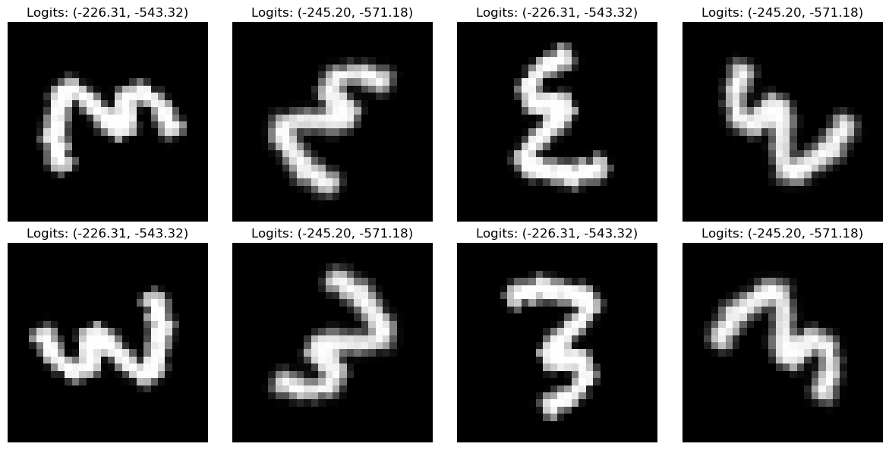
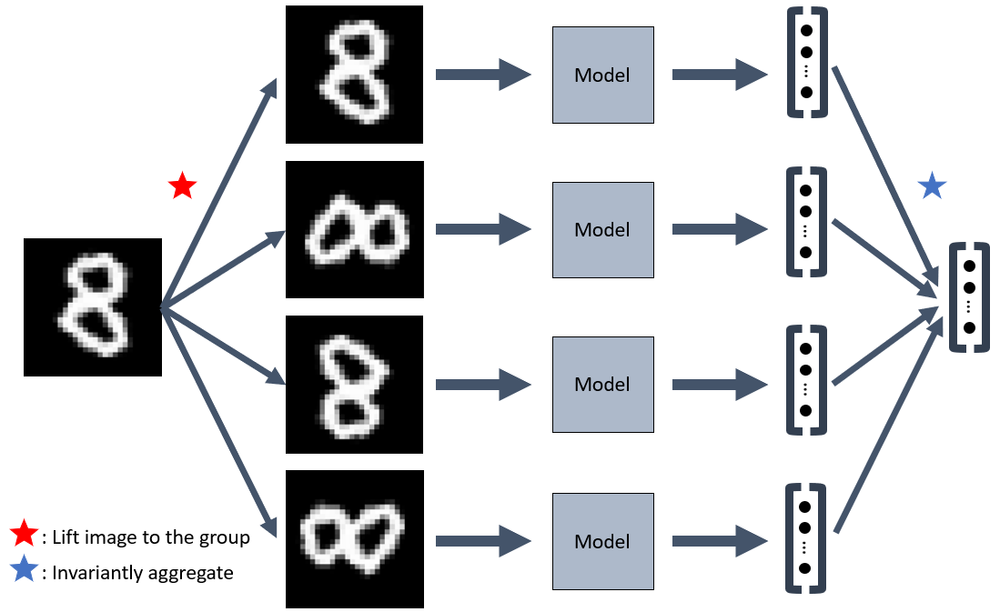
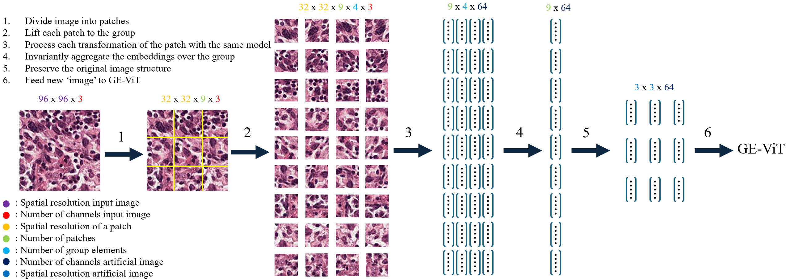

## E(2) Equivariant Vision Transformer

[comment]: <Total blogpost should be a 20 minute read>

### Wouter Bant, Colin Bot, Jasper Eppink, Clio Feng, Floris Six Dijkstra

---
In this blogpost, we aim to propose and evaluate alternative methods for the equivariant attention models discussed in (TODO cite). 

In particular, in this blogpost, we present:
1. Evaluate existing and novel methods to make non equivariant (attention) models, equivariant by combining the predictions of different transformations, that reflect inductive biases, of the input.
2. Evaluate a novel method to make modern ViTs (TODO cite google) equivariant by combining equivariant CNNs (TODO cite) to project patches to latent embeddings that will be uses as input to the equivariant vision transformer model used by (TODO cite paper).
3. Visualize different layers of equivariant and non equivariant, with the aim to help researchers better understand these models. 
---

## The Importance of Equivariant Models
In this section we motivate why one should be interested in equivariant models and discuss prior work.

Here we should display the difference in outputs for an equivariant and non equivariant model. TODO make a slider that rotates an input image for rotation mnist and that displays the output for both.

## Vision Tranformers (ViTs) and Equivariance
In this section we discuss modern ViTs and older equivariant versions.

Here we should display how positional encoding makes the model equivariant.

## Discussion of (TODO cite paper)
Here we say that these methods are comp. expensive and some of our findings. eg steerable but also artifact like differences (show this with a figure). quickly mention we evaluate on validation set a increase batch size (and proportionally learning rate) because of computational constraints. Display the results we got for their methods here and say we use the reported numbers of the best method in the following parts of the blogpost. 

## Post Hoc Equivariant Models
### Introduction
Equivariant models offer many advantages, but they are often memory-intensive and require numerous epochs to converge. This has hindered their widespread adoption. To address this issue, we have built upon the work of Basu (TODO citation needed) to make any image classification model equivariant with minimal ot no fine-tuning.

Basu (TODO citation needed) achieved this by invariantly aggregating the latent dimensions of transformed inputs. In his work, he proposed several methods, including mean pooling and using a neural network to assign importance scores for a weighted average of embeddings. The pipeline for this method is visualized in the image below:

This image illustrates how post hoc equivariance works. The input image undergoes various transformations to achieve equivariance (in this case, 90-degree rotations). Each transformed image is processed by the same model, which generates latent embeddings or class probabilities. These embeddings (or probabilities) are then aggregated in an invariant manner.

In addition to the aggregation methods suggested by Basu, we propose and evaluate the following approaches for aggregating latent dimensions: sum pooling, max pooling, and multi-head attention without positional encodings. Furthermore, we experiment with predicting the class with the highest probability among all transformations and predicting the class with the highest product of probabilities. In the next section, we will discuss these methods in more detail.

### Method
Similar to the idea of Basu et al. (2023), which they proposed a finetuning method called equituning that starts with potentially non-equivariant model M and produces a model $M_G$ that is equivariant to a group G. 

Given a set $\chi$, group action of G on X is defined as $\Gamma X$: $G \times \chi$ -> $\chi$. We write $\Gamma X(g,x)$ simply as gx for bervity. A model M: X -> Y is equivariant to G under the group action of G on X and Y if M(gx) = g(M(x)) for all g $\in$ G, x $\in$ $\chi$. This essentially means that any group transformation g to the input $\Gamma X(g,x)$ should reflect with an equivalent group transformation of the output  $\Gamma Y(g,M(x))$.

Equituning converts a pretrained model into an equivariant version by minimizing the distance of features obtained from pretrained and equivariant models. Here, we proposed three methods. The output of an equituned model is given by

- $ x $ as the input image.
- $ g $ as a transformation in the group $ G $.
- $ g^{-1} $ as a inverse of the transformation in the group $ G $.
- $ M(x) $ as the output logits obtained from the original input image $ x $.
- $ M_G(x) $ as the output logits obtained from the transformed input image $ gx $.

Mean Pooling: $$ M_G(x) = \frac{\sum_{g \in G}{g^{-1}M(gx)}}{|G|} $$

Max Pooling: $$ M_G(x) = \max_{g \in G}{g^{-1}M(gx)} $$

Summing latent dimensions: $$ M_G(x) = \sum_{g \in G}{g^{-1}M(gx)} $$

#### Most Probable and Certain

Instead of combining the embedding to get the final logits, in this approach, we computes logits for each transformation independently. Here, we propose two method to select the final logits.

Select Most Probable: combines them to get the final logits.

$$  M_G(x) = \log \left( \prod_{g \in G}\text{softmax}{(M(gx))} \right) $$

Selct Most Certain: selects the transformation with the highest probability for each class. It then selects the logits corresponding to these highest probabilities.

$$  M_G(x) = \text{arg max}_{g \in G} (\text{softmax}{(M(gx))}) $$

#### Score Aggregation
Similar to the idea of λ-equitune in (Sourya Basu (2023). Efficient Equivariant Transfer Learning from Pretrained Models), revolves around recognizing that, within a pretrained model M, features M(gx) derived from fixed x are not uniformly crucial across all transformations g $\in$ G. Let λ(gx) denote the significance weight assigned to feature M(gx) for g $\in$ G, x $\in$ X. Assuming a finite G, as in Basu et al. (2023), λ : X → $R^+$ is predefined. The λ-equituned model, denoted as $M^{λ} {G}$, aims to minimize:

$$\min_{ M_G^{λ}(x)} \sum_{g \in G} || λ(gx) M(gx) -  M_G^{λ}(g,x)||^{2}$$

subject to:

$$ M_G^{λ}(gx) = g M_G^{λ}(x)$$ 
for all g $\in$ G.

The solution to the above equation, referred to as λ-equitune, is given by:

$$ M_G^{λ}(x) = \frac{\sum_{g \in G}^{|G|}{g^{-1}λ(gx)M(gx)}}{\sum_{g \in G}{λ(gx)}}$$

#### Transformer Aggregation

This method aggregates the embeddings using the transformer and then passes the combined embeddings through the model's MLP head to get the final logits. Since the transformer operations (layer normalization, multi-head attention, and feed-forward networks) do not depend on the order of embeddings, the aggregated result is independent of the transformations applied to the input. The final logits are produced by passing the aggregated embeddings through the MLP head. This process is invariant to the transformations since it operates on the aggregated embeddings, which represent the transformed input space.

   $$
   M_G(x) = \text{Mlp}(\text{Transformer}(M(gx))), g\in G
   $$

Since the aggregation model (transformer) is designed to handle sequences of embeddings in an order-invariant manner (due to the self-attention mechanism), the output should remain consistent under the same group transformations applied to the input and the output:

$$
 M_G(x) = g( M_G(x))
$$

Therefore, the `PostHocLearnedAggregation` model is equivariant by design because the transformer aggregation maintains the equivariance property through its self-attention mechanism and the consistent application of transformations across the input space. The use of the class token ensures that the final output logits are derived in a manner that respects the input transformations.

### Results
We evaluated all approaches through various experiments, examining their zero-shot impact, the effect of fine-tuning only the last layer, and the impact of fine-tuning the entire model.

We conducted the following experiments:
1. Training and evaluating on rotation MNIST.
2. Training on standard MNIST and evaluating on rotation MNIST.
3. Training on 10% of rotation MNIST and evaluating on rotation MNIST.
4. Evaluating a pretrained RESNET-50 on Patch Camelyon.

> **NOTE:** All details needed for reproducing our results are provided in the section [Experimental Details](#experimental-details).

#### 1. Training and evaluating on rotation MNIST
In the first experiment, we trained and evaluated on rotation MNIST as done in [GeViT] and [GSA-Nets] (citations needed). Below are the reported test accuracies of the best models, obtained with a patch size of 5 and 12 rotations.

<table>
<thead>
<tr>
<th align="center">Model</th>
<th align="center">Best Reported Test Accuracy</th>
</tr>
</thead>

<tbody>
<tr>
<td align="center">GSA - Nets</td>
<td align="center">97.97</td>
</tr>
<tr>
<td align="center">GE-ViT</td>
<td align="center">98.01</td>
</tr>
</tbody>
</table>

Below we present the results for the different aggregation methods without fine-tuning, with fine-tuning the last layer, and with fine-tuning the entire model. The first row (ViT) represents the Vision Transformer we trained on rotation MNIST, and we applied our framework to this model.

<table>
    <thead>
        <tr>
            <th>Model</th>
            <th colspan = 2>No finetuning</th>
            <th colspan = 2>MLP finetuning</th>
            <th colspan = 2> Model finetuning </th>
        </tr>
        <tr>
            <th></th>
            <th align="center">Validation Accuracy</th>
            <th align="center">Test Accuracy</th>
            <th >Validation Accuracy</th>
            <th >Test Accuracy</th>
            <th >Validation Accuracy</th>
            <th >Test Accuracy</th>
        </tr>
    </thead>
    <tbody>
<tr>
<td>VisionTransformer</td>
<td align="center">97.55</td>
<td align="center">97.234</td>
<td align="center">97.55</td>
<td align="center">97.234</td>
<td align="center">97.55</td>
<td align="center">97.234</td>
</tr>
<tr>
<td>PostHocEquivariantMean</td>
<td align="center">98</td>
<td align="center">98.074</td>
<td align="center">98.2</td>
<td align="center">98.202</td>
<td align="center">98.7</td>
<td align="center">98.242</td>
</tr>
<tr>
<td>PostHocEquivariantMax</td>
<td align="center">97.8</td>
<td align="center">97.818</td>
<td align="center">98.1</td>
<td align="center">98.116</td>
<td align="center">98.65</td>
<td align="center">98.314</td>
</tr>
<tr>
<td>PostHocEquivariantSum</td>
<td align="center">98</td>
<td align="center">98.074</td>
<td align="center">98.2</td>
<td align="center">98.202</td>
<td align="center">98.7</td>
<td align="center">98.244</td>
</tr>
<tr>
<td>PostHocEquivariantMostProbable</td>
<td align="center">97.9</td>
<td align="center">98.094</td>
<td align="center">98.15</td>
<td align="center">98.14</td>
<td align="center">98.45</td>
<td align="center">98.178</td>
</tr>
<tr>
<td>PostHocMostCertain</td>
<td align="center">97.75</td>
<td align="center">97.628</td>
<td align="center">97.95</td>
<td align="center">97.936</td>
<td align="center">98.4</td>
<td align="center">98.098</td>
</tr>
<tr>
<td>PostHocLearnedScoreAggregation</td>
<td align="center">96.6</td>
<td align="center">96.46</td>
<td align="center">95.65</td>
<td align="center">95.478</td>
<td align="center">96.6</td>
<td align="center">96.46</td>
</tr>
<tr>
<td>PostHocLearnedAggregation</td>
<td align="center">96.8</td>
<td align="center">96.748</td>
<td align="center">96.65</td>
<td align="center">96.328</td>
<td align="center">96.8</td>
<td align="center">96.748</td>
</tr>
    </tbody>
</table>

The table above presents interesting results on many accounts. First, it shows that, except for the methods that require learning, all methods improve the results from the base model. This is surprising because, for example, summing or taking the maximum element of the latent embeddings would likely significantly alter the embeddings the final layers saw during training. Nevertheless, the model finds a way to accurately project these modified embeddings to logits. 

Second, as expected, the dominant trend shows that fine-tuning the last layer leads to better results, with further improvements observed when fine-tuning the entire model. Third, it can be seen that multiple models outperform the best-reported baselines, even after only fine-tuning the final layer. All models that aggregate without additional parameters outperform the baselines when we fine-tune the entire model. This means that better results can be achieved without the use of inherently equivariant models, however, post-hoc augmentations are essential in this experiment.

We found that in this experiment, learning to score the embeddings or learning to aggregate the embeddings with multi-head attention led to overfitting, resulting in worse validation and test accuracies.
 
#### 2. Training on normal MNIST and evaluating on rotation MNIST
One of the advantages of purely equivariant models is that the training data can be in different orientations than the test data, as long as the transformations between the training and testing examples are within the group the model is equivariant to. This is typically not the case for non-equivariant models. Therefore, we now test how well post-hoc methods can improve the performance of non-equivariant models.

<table>
    <thead>
        <tr>
            <th>Model</th>
            <th colspan = 2>No finetuning</th>
            <th colspan = 2>MLP finetuning</th>
            <th colspan = 2> Model finetuning </th>
        </tr>
        <tr>
            <th></th>
            <th >Validation Accuracy</th>
            <th >Test Accuracy</th>
            <th >Validation Accuracy</th>
            <th >Test Accuracy</th>
            <th >Validation Accuracy</th>
            <th >Test Accuracy</th>
        </tr>
    </thead>
    <tbody>

<tr>
<td>VisionTransformer</td>
<td align="center">29.75</td>
<td align="center">28.724</td>
<td align="center">29.75</td>
<td align="center">28.724</td>
<td align="center">29.75</td>
<td align="center">28.724</td>
</tr>
<tr>
<td>PostHocEquivariantMean</td>
<td align="center">43.5</td>
<td align="center">43.314</td>
<td align="center">84.9</td>
<td align="center">85.496</td>
<td align="center">97.4</td>
<td align="center">97.526</td>
</tr>
<tr>
<td>PostHocEquivariantMax</td>
<td align="center">41.65</td>
<td align="center">41.888</td>
<td align="center">86.75</td>
<td align="center">87.128</td>
<td align="center">97.35</td>
<td align="center">97.28</td>
</tr>
<tr>
<td>PostHocEquivariantSum</td>
<td align="center">43.5</td>
<td align="center">43.314</td>
<td align="center">84.9</td>
<td align="center">85.496</td>
<td align="center">97.4</td>
<td align="center">97.526</td>
</tr>
<tr>
<td>PostHocEquivariantMostProbable</td>
<td align="center">30.05</td>
<td align="center">29.298</td>
<td align="center">10</td>
<td align="center">9.998</td>
<td align="center">10</td>
<td align="center">9.998</td>
</tr>
<tr>
<td>PostHocMostCertain</td>
<td align="center">47.95</td>
<td align="center">48.992</td>
<td align="center">82.95</td>
<td align="center">82.522</td>
<td align="center">96.3</td>
<td align="center">96.26</td>
</tr>
<tr>
<td>PostHocLearnedScoreAggregation</td>
<td align="center">83.8</td>
<td align="center">83.28</td>
<td align="center">87.35</td>
<td align="center">86.996</td>
<td align="center">94.9</td>
<td align="center">94.988</td>
</tr>
<tr>
<td>PostHocLearnedAggregation</td>
<td align="center">92.75</td>
<td align="center">92.426</td>
<td align="center">92.75</td>
<td align="center">92.408</td>
<td align="center">96.65</td>
<td align="center">96.16</td>
</tr>
        <tr>
    </tbody>
</table>

TODO need a figure for this

The non-equivariant model trained on MNIST attained an accuracy of around 29% on rotation MNIST. This model can accurately predict the digits in their normal orientation but struggles with heavily rotated images. The best approach that doesn't require any learning is selecting the transformation that gives the highest probability to one particular class, achieving a test accuracy of 49%. This can be explained by the model being uncertain about transformations of digits that were unseen during training but assigning high probability to digits close to their original orientation. However, a digit 6 rotated by 180 degrees is likely to be predicted as a 9, indicating that this method is not foolproof.

Interestingly, the models that require learning perform much better in this experiment. Aggregating the embeddings with multi-head attention even leads to an accuracy of about 92% while keeping all parameters of the original model fixed. However, similar to the previous results, when fine-tuning the entire model, taking the mean or sum of the embeddings proves to be more effective.

#### 3. Training on 10% of rotation MNIST and evaluating on rotation MNIST.
One key advantage of equivariant models is their data efficiency, owing to the way inductive biases are incorporated (TODO citation needed). Therefore, we now compare the performance of post hoc methods against the equivariant models used in (TODO paper citation needed) when training on only 10% of the rotated MNIST dataset.

We also evaluated the performance of GE-ViT when trained on a reduced dataset comprising only 10% of the total data. Interestingly, we observed that this model reached convergence after 600 epochs, achieving a test accuracy of only 83.55%. However, this accuracy was notably lower compared to when the model was trained on the complete training set.

<table>
    <thead>
        <tr>
            <th>Model</th>
            <th colspan = 2>No finetuning</th>
            <th colspan = 2>MLP finetuning</th>
            <th colspan = 2> Model finetuning </th>
        </tr>
        <tr>
            <th></th>
            <th >Validation Accuracy</th>
            <th >Test Accuracy</th>
            <th >Validation Accuracy</th>
            <th >Test Accuracy</th>
            <th >Validation Accuracy</th>
            <th >Test Accuracy</th>
        </tr>
    </thead>
    <tbody>

<tr>
<td>VisionTransformer</td>
<td align="center">86.25</td>
<td align="center">86.208</td>
<td align="center">86.25</td>
<td align="center">86.208</td>
<td align="center">86.25</td>
<td align="center">86.208</td>
</tr>
<tr>
<td>PostHocEquivariantMean</td>
<td align="center">88.5</td>
<td align="center">88.994</td>
<td align="center">88.75</td>
<td align="center">89.196</td>
<td align="center">89.3</td>
<td align="center">89.734</td>
</tr>
<tr>
<td>PostHocEquivariantMax</td>
<td align="center">88.15</td>
<td align="center">88.734</td>
<td align="center">88.4</td>
<td align="center">88.956</td>
<td align="center">88.9</td>
<td align="center">89.406</td>
</tr>
<tr>
<td>PostHocEquivariantSum</td>
<td align="center">88.5</td>
<td align="center">88.994</td>
<td align="center">88.75</td>
<td align="center">89.196</td>
<td align="center">89.3</td>
<td align="center">89.734</td>
</tr>
<tr>
<td>PostHocEquivariantMostProbable</td>
<td align="center">88.6</td>
<td align="center">89.028</td>
<td align="center">88.9</td>
<td align="center">89.12</td>
<td align="center">86.75</td>
<td align="center">87.19</td>
</tr>
<tr>
<td>PostHocMostCertain</td>
<td align="center">87.1</td>
<td align="center">87.884</td>
<td align="center">87.75</td>
<td align="center">88.336</td>
<td align="center">88.5</td>
<td align="center">88.872</td>
</tr>
<tr>
<td>PostHocLearnedScoreAggregation</td>
<td align="center">80.3</td>
<td align="center">80.754</td>
<td align="center">78.95</td>
<td align="center">79.096</td>
<td align="center">81.85</td>
<td align="center">82.27</td>
</tr>
<tr>
<td>PostHocLearnedAggregation</td>
<td align="center">82.25</td>
<td align="center">82.656</td>
<td align="center">82.15</td>
<td align="center">82.634</td>
<td align="center">84.5</td>
<td align="center">84.438</td>
</tr>
    </tbody>
</table>

In line with our findings on the full rotation MNIST dataset, we find that learning to aggregate the embeddings often resulted in overfitting. Also, the other methods consistently enhanced performance, with fine-tuning showing even greater improvements and mean pooling and summing of latent dimensions lead to the highest accuracies. Remarkably, our non-equivariant ViT already surpassed the GE-ViT in performance. Throughout our experiments, we observed that GE-ViT exhibited high sensitivity to minor changes in hyperparameters. We hypothesize that optimizing hyperparameters could potentially yield higher accuracy. However, due to computational constraints, we didn't explore this further.

#### 4. Evaluating a pretrained RESNET-50 on Patch Camelyon
Until now, our analysis has been limited to our own models trained exclusively on either MNIST or rotation MNIST. However, it's worth noting that the post hoc methods discussed can be applied to pretrained models trained on various datasets. To validate the robustness of our findings, we use a [trained RESNET-50 model](https://huggingface.co/1aurent/resnet50.tiatoolbox-pcam). We are grateful to TIAToolbox for offering a wide range of pretrained models for this dataset, we found it challenging to find well performing models elsewhere.

<table>
<thead>
<tr>
<th align="center">Model</th>
<th align="center">Best Reported Test Accuracy</th>
</tr>
</thead>

<tbody>
<tr>
<td align="center">GSA - Nets</td>
<td align="center">82.26</td>
</tr>
<tr>
<td align="center">GE-ViT</td>
<td align="center">83.82</td>
</tr>
</tbody>
</table>

<table>
    <thead>
        <tr>
            <th>Model</th>
            <th colspan = 2>No finetuning</th>
            <th colspan = 2>finetuning</th>
        </tr>
        <tr>
            <th></th>
            <th >Validation Accuracy</th>
            <th >Test Accuracy</th>
            <th >Validation Accuracy</th>
            <th >Test Accuracy</th>
        </tr>
    </thead>
    <tbody>
<tr>
<td>VisionTransformer</td>
<td align="center">87.75939941</td>
<td align="center">86.60583496</td>
<td align="center">87.75939941</td>
<td align="center">86.60583496</td>
</tr>
<tr>
<td>PostHocEquivariantMean</td>
<td align="center">88.07067871</td>
<td align="center">87.26806641</td>
<td align="center">90.39916992</td>
<td align="center">87.51525879</td>
</tr>
<tr>
<td>PostHocEquivariantMax</td>
<td align="center">86.66992188</td>
<td align="center">86.1541748</td>
<td align="center">90.07873535</td>
<td align="center">86.93847656</td>
</tr>
<tr>
<td>PostHocEquivariantSum</td>
<td align="center">88.29345703</td>
<td align="center">87.43286133</td>
<td align="center">90.33203125</td>
<td align="center">87.14599609</td>
</tr>
<tr>
<td>PostHocEquivariantMostProbable</td>
<td align="center">88.07067871</td>
<td align="center">87.26806641</td>
<td align="center">90.37475586</td>
<td align="center">87.14294434</td>
</tr>
<tr>
<td>PostHocMostCertain</td>
<td align="center">87.89672852</td>
<td align="center">87.10632324</td>
<td align="center">90.0390625</td>
<td align="center">86.98120117</td>
</tr>
    </tbody>
</table>
We assessed the pretrained model's performance on PCam's validation and test sets, revealing accuracies of 87.8% and 86.6% respectively. Remarkably, employing mean pooling boosted these accuracies to 90.4% and 87.5% through just 1 epoch of fine-tuning. Additionally, both summing and the most probable method yielded favorable results in this experiment, underscoring the efficacy of incorporating inductive biases into pretrained models to enhance performance.

A notable observation is the considerable gap between validation and test accuracies. Given our single-epoch fine-tuning approach on the training set, it's strange why the validation accuracy would differ significantly from the test accuracy. Similar trends were noticed in other PCam experiments, where models exhibited rapid validation accuracy growth but more subdued improvements on the test set. We encourage further study on this dataset as it is a widely used benchmark.

Furthermore, our findings demonstrate the superiority of large models over GSA-nets and GE-ViTs. However, it's crucial to acknowledge the parameter discrepancy, comparing models with 45,000 parameters to one of 23.6 million. Attempting to scale up GE-ViTs to over a million parameters was not feasible for us, exceeding the limitations of our 40GB RAM GPU with a batch size of 1. While this indicates poor scalability, it's worth exploring how these models perform when scaled up, given our evidence that integrating inductive biases significantly enhances performance.

## Introducing Equivariant Modern ViTs
GSA-Nets and GE-ViTs are slow because attention is applied on the pixel level. One way to reduce the computational complexity is to reduce the number of pixels in the image. For this we create an artificial image, where patches are projected to a single vector representing the new pixel in the artificial image. The entire piple in visualized in the image below:
 
> As in the normal ViT we create patches, however, these patches are lifted to the group and the resulting transformations are each processed by the same model. Afterwards, the image are invariantly aggregated over the group and reshaped to the original image structure but now with less pixels. The resulting artificial image is fed to GE-ViT as normal.

We experiment with two ways of obtaining invariant patch embeddings. First we experiment with using a normal neural network to obatain emeddings that we combine with mean pooling. Second, we apply an equivariant CNN onto image patches directly and use that output for pixel embedding.

## Concluding Remarks
TODO make table with inference and training speeds of all models together with # of parameters

In this blog post, we conducted a thorough evaluation of existing methods while also proposing new approaches to achieve equivariance in pretrained models with minimal to no fine-tuning. Our findings highlight mean pooling of latent dimensions as the most reliable method, consistently delivering strong performance across all experiments. Notably, performance saw incremental gains with fine-tuning the last layer and further enhancements when fine-tuning the entire model. Importantly, this simple yet effective approach outperforms equivariant attention models without altering their original training paradigms.

It's crucial to recognize that this approach only confers equivariance to global transformations. Additionally, since the pretrained models lacked translation equivariance, the final models remain non-translation equivariant, solely equivariant to the O(2) and/or SO(2) groups. However, applying these methods to CNNs, inherently translation equivariant, would yield equivariance to the E(2) and/or SE(2) groups. We advocate for researchers to explore these methods' efficacy when applied to CNNs and across diverse datasets.

We firmly believe that true equivariant models possess the potential to achieve superior performance, requiring less data, particularly with ample computational resources. However, in scenarios where computational resources are limited for training, the post hoc methods presented here offer a viable solution. They can be directly applied to pretrained models, robustly enhancing performance by significant margins.

Post Hoc Equivariant models, compared to inherently equivariant models:

| Pros                         | Cons                           |
|-------------------------------|---------------------------------|
|              Directly applicable to trained image classification models                |                  Only global invariant               |
|               Simple                |              Not straightforward to apply to different tasks                   |
|              Proven to be effective                 |              Susceptible to interpolation effects as descrete transformations are used                   |
|              Provides geometric guarantees                 |              Slows down model during inference                   |
|              Scalability is determined by the base model                  |              Base model wastes parameters to learn equivariant properties                    |

To address these cons, future work could explore the following ideas:
- *Only global invariant*: apply the transformations to patches of the image as opposed to the whole image.
- *Not straightforward to apply to different tasks*: for graph neural networks one could consider combining the outputs from equivalent slightly different permutations. With only slightly changing the input one can reuse the majority of computations from other permutations.
- *Susceptible to interpolation effects as discrete transformations are used*: for rotations one could pad the image with black pixels to make the image a circle. Now don't make square patches but rings and split these up into multiple parts to preserve locality. During training mask out the black pixels.
- *Slows down model during inference*: although all transformations are processed simultaneously, one could explore the possiblity of predicting the useful transformations with a small neural network to save computations spend on uninformative/misleading transformations.

*Base model wastes parameters to learn equivariant properties*: the only ways to solve this are either by using an equivariant network, or transforming all inputs in a similar way. The former gives most guarantees, but is parameters a more important metric than training/inference time?
## References

## Experimental Details
List all hyperparameters and model architectures here

#### Introduction

[comment]: <Also add one paragraph of related work, should be similar to reviews on OpenReview.net>

[comment]: <Find out how the positional encoding truly is implemented and how this causes the equivariance property>

[comment]: < Mention the difference between E(2) and SE(2) equivarance, answer: SE(2) equivariance also adds reflection equivariance.>

Equivariance, a fundamental property in various domains including image processing [Krizhevsky and Ilya 2012](https://proceedings.neurips.cc/paper/2012/hash/c399862d3b9d6b76c8436e924a68c45b-Abstract.html), 3D point cloud analysis [Li, Chen and Lee 2018](https://openaccess.thecvf.com/content_cvpr_2018/html/Li_SO-Net_Self-Organizing_Network_CVPR_2018_paper.html), chemistry [Faber et al.](https://journals.aps.org/prl/abstract/10.1103/PhysRevLett.117.135502), astronomy [Ntampaka 2016](https://iopscience.iop.org/article/10.3847/0004-637X/831/2/135/meta), and economics [Qin et al. 2022](https://proceedings.neurips.cc/paper_files/paper/2022/hash/730d61b4d9ff794a028fa3a25b9b891d-Abstract-Conference.html), has garnered significant attention in the realm of machine learning. Traditional Convolutional Neural Networks (CNNs) exhibit translation equivariance but lack equivariance to rotations in input data. [Cohen and Welling 2016](https://proceedings.mlr.press/v48/cohenc16.html) introduced the first equivariant neural network, which augmented the existing translation equivariance of CNNs by incorporating translation into discrete groups.

In the realm of Natural Language Processing (NLP), [Vaswani et al. 2017](https://proceedings.neurips.cc/paper_files/paper/2017/hash/3f5ee243547dee91fbd053c1c4a845aa-Abstract.html) introduced transformers, a model that gained significant prominence in its field. Recognizing the potential of this architecture in computer vision, [dosovitskiy et al. 2020](https://arxiv.org/abs/2010.11929) proposed the original vision transformer architecture. However, a limitation of their approach is necessitating positional encodings for each pixel patch, losing the translation or any other form of equivariance. Despite this drawback, vision transformers demonstrated noteworthy performance, achieving state-of-the-art results in various domains. To allow ViTs to be equivariant to affine groups, new positional encodings need to be proposed to replace the original positional encodings. 

Initial attempts have been made to modify the self-attention to become equivariant. Some examples include ...... The most promising work in the field is proposed by [Romero et al. 2020](https://proceedings.mlr.press/v119/romero20a.html). They proposed Group Equivariant Stand Alone Self-Attention Networks (GSA-nets), which incorporated a different positional encoding strategy and modifications to the attention mechanism to ensure equivariance.

[comment]: <Dont forget to add the research question> 

#### Weaknesses and strengths of the proposed method

The authors of the original equivariant vision transformer mention that their proposed positional encodings for the (pixels or patches) result in an E(2) equivariant network. This has the advantage that this results in consistent results and predictions even for rotated images. This is one very strong strength as such properties are very important in medical cell analysis where you do not want different predictions for the same cells by only rotating an image.

Furthermore, typically one of the advantages of equivariant networks is that they use weight sharing and generalize faster (Hier nog een bron voor vinden). This is something that the authors didn't focus on, however this advantage is something that we want to look at.

One of the main weaknesses that we seeked to explore with their proposed method are the following. 
1. In the original paper, the author mentions that using the group equivariant vision transformer significantly outperforms non-equivariant self-attention networks. We doubt this claim and believe that retraining a Vision-Transformer and making it rotation equivariant ad-hoc could significantly improve performance. (Note that one downside of this approach is that it is not translation invariant right, can this be changed using e.g. the weird attention they used???)
2. Next up, one of the weaknesses of the original GE-VIT is it training and inference time. In the original paper, the authors mention that they use the well-known ViT, however this is not the case. The original well-known ViT and the original GSA net paper were published in the same journal on the same date. The Vision Transformer they use applies local self-attention for every single pixel which makes the model translation equivariant however also computationally very expensive. This can be made more computationally efficient by dividing the images in patches and apply the equivarent things to those patches. Their proposed architecture uses for MNIST and the lifting layer and rotation of 90 degrees the following input. ([8, 9, 4, 28, 28, 9, 9]) = (batch size, num_heads, the 4 rotations, height, width, patch size, patch size) where patch size refers to the local neighborhood that should be taken into account for attention. Aka for a single pixel it computes attention to 81 different other pixels and then you do this for each 28*28*9*4=28244 pixels making a total of 81*28244=2,286,144 attention computations just for the lifting layer. Having this many attention computations causes training and inference time to be slow for even relatively low resolution images.

3. A third weakness that we discovered has to do with the implementation that the authors used to train and evaluate the performance of their models. When expecting their source code, we found that the authors used the test set during training for evaluating the performance of their method. In the end after training, the epoch with the best performance on the test set was reported as the result. This is not a good practice as this causes overfitting on the test set, while a test set should only be used to predict performance on the final model.
4. The original paper states that their approach is steerable because the positional encoding lives in a continuous space. This however appears to be incorrect because rotations of 45 degrees will get different positional encodings than for 90 degrees. See results in the google docs. This is likely caused by the interpolation effect.

#### Our contributions

Our main contributions can be divided into three parts:

- First, we investigate and propose methods to make pretrained, non-equivariant models, equivariant by combining either the latent embeddings or probabilities from transformed input images (TODO make picture that shows this). We compare this model with the equivariant ViT proposed in (TODO citation) on rotation MNIST. Also, we investigate its performance on rotation MNIST when the non-equivariant model was only trained on (normal) MNIST. Furthermore, we compare the models by only training on 10% of the dataset.

- Second, we propose a way of making the modern ViT equivariant. For this, we make use of the model by (TODO cite the paper), where the inputs are not the raw pixels but patch embeddings coming from an equivariant CNN (TODO cite).

- Third, we visualize the equivariant ViT proposed by (TODO cite) to gain insight into the learned positional encoding and other layers that make the model equivariant.

Some of the contributions that we want to add to this paper are already briefly discussed in the section above as we want to improve upon all the weaknesses mentioned. Furthermore, we also propose a novel architecture which utilizes a combination of a group-equivariant CNN together with a transformer and see if this is able to outperform their baseline

- The ViT we propose uses a patch size (the normal one) of 4x4. So 49 patches in total. Now you compute attention globally with respect to the other patches and yourself. If all other settings are the same we have that you do this for 49*9*4=1764 patches in total, making a total of 49*1764=86,436 attention computations for the lifting layer. This should make it about 26 times faster, so for rotmnist 10 hours/26=23 minutes.

- Maybe do interpretablility analyses but I feel like we should not do that.

[comment]: <How do we want to visualise attention as in the original ViT paper (okey ik ga die paper wel even bestuderen Figure 6 dus kijken)>

#### Results

##### Post Hoc Equivariance

In this section we display results for pretrained models that are made equivariant by combining the results from different test time augmentations.

###### Training on MNIST and evaluating on rotation MNIST 

##### Results on Mnist with 10% of the data

In the table below, the results on Mnist with 10% of the data is shown. These experiments are identical to those above except for using less data. In Deep Learning, equivariant methods by design typically need less data as these apply weight sharing. We test this by looking at accuracy when only 10% of the training data is used.

##### Results on PCAM

Besides evaluating our proposed equivariant models on only Mnist, we also trained and evaluated it on the Patchcamelyon dataset. In these results equivariance was tested......??????

In these experiments there is only one type of finetuning which is......

In the table below results for our proposed models and the benchmark scores are denoted.

#### Conclusion

#### Individual contributions

Below the contributions for each team member are noted

Wouter Bant:

Colin Bot:

Jasper Eppink:
Contributed mainly to the writing of the blogpost. As written the introduction and the weaknesses. Also aided with thinking about the programming challenges and the novelties that we wanted to research. 

Clio Feng:

Floris Six Dijkstra
