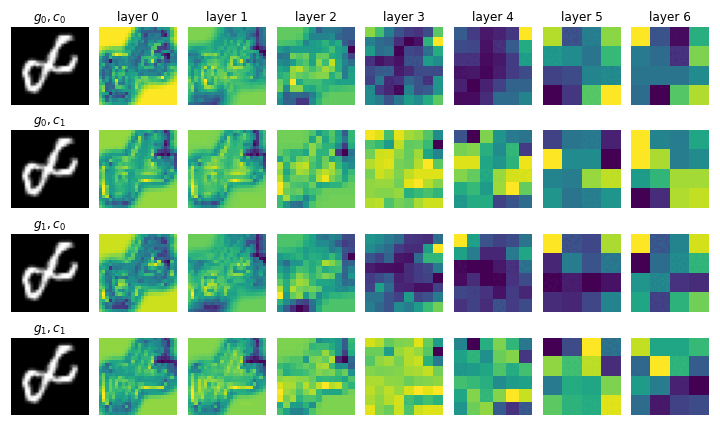

# E(2) (Post-Hoc) Equivariant (Attention) Models for Image Classification 

### Wouter Bant, Colin Bot, Jasper Eppink, Clio Feng, Floris Six Dijkstra

Inspired by the equivariant attention model present in [Group Equivariant Vision Transformer](https://openreview.net/forum?id=uVG_7x41bN),  UAI 2023, we conduct experiments to validate the performance of the presented model. Furthermore, we present and evaluate several ways of making non-equivariant models equivariant by test time augmentations. Building on the GE-ViT, we make the modern ViT equivariant. Also, we provide many visualizations for a better understanding of GE-ViTs and other presented methods.

For the full analysis see [our blogpost](Blogpost.md), but to give a little preview:

- 👓 We visualize many layers of the [Group Equivariant Vision Transformer](https://openreview.net/forum?id=uVG_7x41bN) (GE-ViT)

- 🎯 Evaluate and propose novel ways of making any image classification model globally E(2) equivariant and beat previous image classification benchmarks:

<table align="center">
  <tr align="center">
      <td></td>
  </tr>
  <tr align="left">
    <td colspan=2><b>Figure TODO NUMBER.</b> Comparing predicted probabilities from the MeanAggregation and MostProbable post-hoc equivariant transformer models in an edge case where a 6 is rotated to possibly be confused with a 9.</td>
  </tr>
</table>

- ⚡ Speed up GE-ViTs by projecting the image to an artificial image with lower spatial resolution for less attention computations:
 

### Acknowledgements
This repository contains the source code accompanying the paper: [Group Equivariant Vision Transformer](https://openreview.net/forum?id=uVG_7x41bN),  UAI 2023.

The original code, containing a small error, is from the [GSA-Nets](https://openreview.net/forum?id=JkfYjnOEo6M) paper by David W. Romero and Jean-Baptiste Cordonnier.
