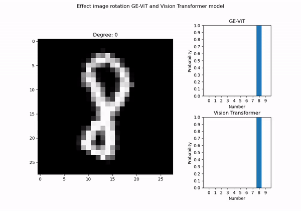
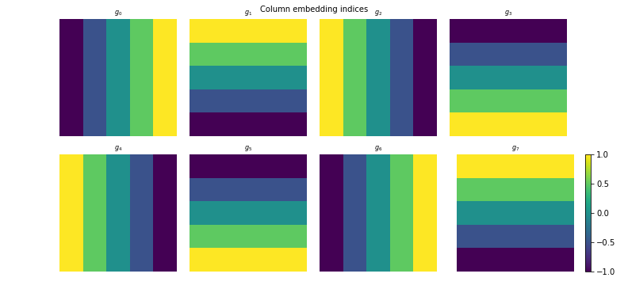
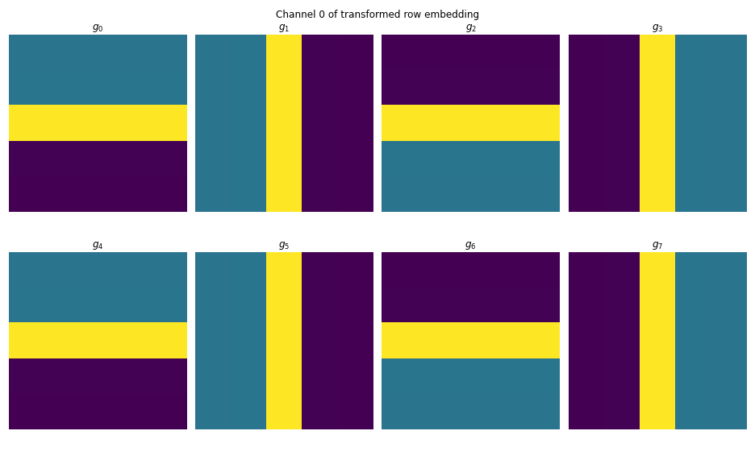
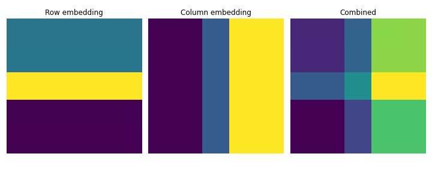
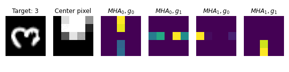
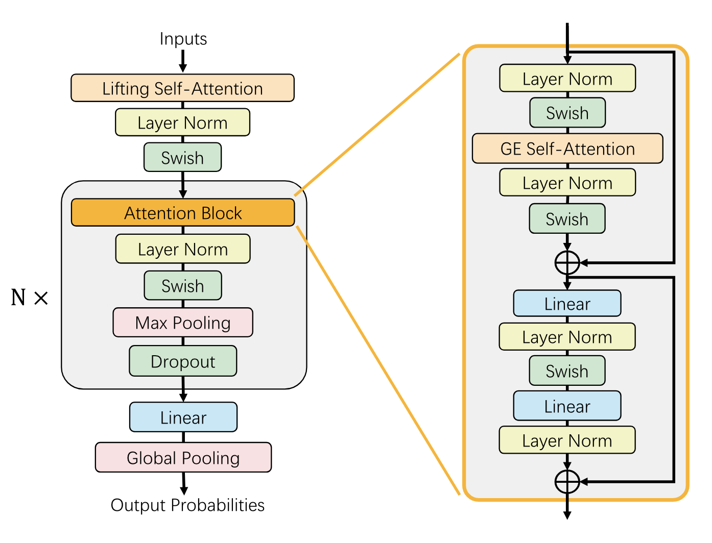
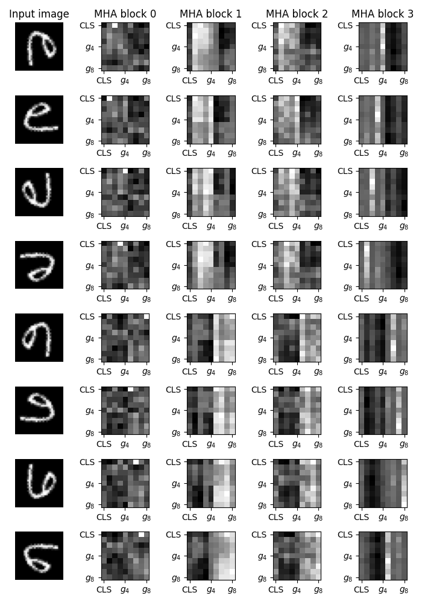

## E(2) Equivariant Vision Transformer

[comment]: <Total blogpost should be a 20 minute read>

### Wouter Bant, Colin Bot, Jasper Eppink, Clio Feng, Floris Six Dijkstra

---
In this blogpost, we dive deeper into E(2) equivariant Vision Transformers, and we propose and evaluate alternative methods for the equivariant attention models discussed in ["E(2)-Equivariant Vision Transformer"](https://proceedings.mlr.press/v216/xu23b.html). This paper proposes a new Group-Equivariant Vision Transformer (GE-ViT), which is claimed to be a new positional encoding for the traditional well-known Vision Transformer (ViT) ["An Image is Worth 16x16 Words: Transformers for Image Recognition at Scale" ](https://arxiv.org/abs/2010.11929)

In particular, in this blogpost, we:
1. Evaluate existing and novel methods to make non equivariant (attention) models (e.g., [Lippe 2023](https://lightning.ai/docs/pytorch/stable/notebooks/course_UvA-DL/11-vision-transformer.html), [Dosovitskiy et al. 2021](https://arxiv.org/pdf/2010.11929)), equivariant by combining the predictions of different transformations of the input, that reflect inductive biases.
2. Propose and evaluate a novel method to make modern ViTs equivariant by using GE-ViTs onto group invariant patch embeddings to project patches to latent embeddings that will be used as input to the equivariant vision transformer model used by [Xu et al.2023](https://arxiv.org/abs/2306.06722).
3. Visualize latent representations in different layers of equivariant and non equivariant models, to help researchers better understand these models. 
---

## The Importance of Equivariant Models
In this section, we explain the significance of equivariant models and review prior work. 

Equivariance is a fundamental property across various domains including image processing [Krizhevsky and Ilya 2012](https://proceedings.neurips.cc/paper/2012/hash/c399862d3b9d6b76c8436e924a68c45b-Abstract.html), 3D point cloud analysis [Li, Chen and Lee 2018](https://openaccess.thecvf.com/content_cvpr_2018/html/Li_SO-Net_Self-Organizing_Network_CVPR_2018_paper.html), chemistry [Faber et al.](https://journals.aps.org/prl/abstract/10.1103/PhysRevLett.117.135502), astronomy [Ntampaka 2016](https://iopscience.iop.org/article/10.3847/0004-637X/831/2/135/meta), and economics [Qin et al. 2022](https://proceedings.neurips.cc/paper_files/paper/2022/hash/730d61b4d9ff794a028fa3a25b9b891d-Abstract-Conference.html). Equivariance means that when a transformation is applied to the input, the output undergoes a corresponding transformation. Simply put, if the input is shifted, rotated, or scaled, the output will shift, rotate, or scale similarly. This provides geometric guarantees and is parameters efficient as weights are shared across transformations.

Traditional Convolutional Neural Networks (CNNs) exhibit translation equivariance but lack equivariance to rotations in their input data. [Cohen and Welling 2016](https://proceedings.mlr.press/v48/cohenc16.html) introduced the first rotation equivariant neural network, which augmented the existing translation equivariance of CNNs by incorporating discrete group transformations of the kernel.

In the field of Natural Language Processing (NLP), [Vaswani et al. 2017](https://proceedings.neurips.cc/paper_files/paper/2017/hash/3f5ee243547dee91fbd053c1c4a845aa-Abstract.html) introduced transformers, a model that quickly gained significant prominence in its field. Recognizing the potential of this architecture in computer vision, [dosovitskiy et al. 2020](https://arxiv.org/abs/2010.11929) proposed vision transformers (ViTs). However, a limitation of their approach is necessitating positional encodings for each patch of pixels, losing the translation or any other form of equivariance. Despite this drawback, vision transformers demonstrated noteworthy performance, achieving state-of-the-art results on various computer vision benchmarks.

Initial attempts have been made to modify self-attention to become group equivariant. Before the release of the GE-ViT model, the most promising work in the field was proposed by [Romero et al. 2020](https://proceedings.mlr.press/v119/romero20a.html). They proposed Group Equivariant Stand Alone Self-Attention Networks (GSA-nets), which incorporated a different positional encoding strategy and modifications to the attention mechanism to ensure equivariance.

<table align="center">
  <tr align="center">
      <td></td>
  </tr>
  <tr align="left">
    <td colspan=2><b>Figure 1.</b> The effect of rotation on the predicted digit for the GE-ViT and the standard ViT</td>
  </tr>
</table>

In Figure 1, the importance of equivariant models becomes evident. The non equivariant model will change its predictions for every different transformation of the input, while the equivariant model consistently provides the same predictions. Guaranteed consistent outcomes are desirable in many fields such as cell analysis, where a model's ability to deliver consistent predictions regardless of image orientation is crucial.

--- 

## Recap on Vision Transformers (ViTs)

[comment]: <In this section we discuss modern ViTs and older equivariant versions.>

<!-- In recent years, the Transformer architecture ["Attention is all you need"](https://proceedings.neurips.cc/paper_files/paper/2017/hash/3f5ee243547dee91fbd053c1c4a845aa-Abstract.html) has had a huge impact in natural language processing (NLP). The success of this architecture has paved the way for an adaptation in computer vision, giving rise to Vision Transformers (ViTs). --> 

The original transformer architecture operates using an encoder-decoder structure. The encoder maps an input sequence $(x_1, ..., x_n)$ to a continuous latent variable $z=(z_1, ...,z_n)$. Using this latent variable $z$, the decoder generates an output sequence $y=(y_1, ..., y_m)$ one element at a time. At each generating time step, the model utilizes its previously generated output. The encoder and decoder both employ self-attention and fully connected layers. This process is depicted in Figure 2.

<table align="center">
  <tr align="center">
      <td></td>
  </tr>
  <tr align="left">
    <td colspan=2><b>Figure 2.</b> The Transformer architecture with the encoder (left) and decoder (right) (INSERT BRON)</td>
  </tr>
</table>

The encoder consists of a stack of $\mathcal{N}$ block layers. Each layer contains two sub-layers: a multi-head self-attention mechanism and a fully connected feed-forward network. Residual connections are used between each sub-layer.

The decoder is similar to the encoder but includes a third sub-layer, which handles multi-head attention on the output generated so far.

<strong> Attention: </strong>

The attention mechanism allows the transformer to assign different weights to individual input tokens, resulting in improved embeddings. Figure 3 provides a toy example where words with higher attention have higher opacity when encoding the word "it."

<table align="center">
  <tr align="center">
      <td></td>
  </tr>
  <tr align="left">
    <td colspan=2><b>Figure 3.</b> An example of attention (INSERT BRON)</td>
  </tr>
</table>

Formally, the attention mechanism maps a query and a set of key-value pairs to an output. The query, key, and value are all vectors. The output is computed by taking the weighted sum of the values, with the weights determined by a scaled dot-product of the query and key vectors followed by a softmax operation. The final architecture uses multi-head attention, which consists of several attention layers computed in parallel. For efficiency, the attention for a set of queries is calculated simultaneously by packing all queries into a matrix Q, all keys into a matrix K, and all values into a matrix V. Figure 4 illustrates the attention mechanism.

<table align="center">
  <tr align="center">
      <td></td>
  </tr>
  <tr align="left">
    <td colspan=2><b>Figure 4.</b> Schematic depiction of the attention mechanism (INSERT BRON)</td>
  </tr>
</table>

<!-- This encoding is not used in ViTs  -->
<!-- <strong> Positional Encoding: </strong>

During the encoding block, the order of the input is not taken into account. To be able to know the order of the words or input, positional encodings are used. These positional encodings allow the Transformer to understand the order of the input sequence. These positional encodings have the same dimension $d_{\text{model}}$ as the input embeddings so that the two can be summed. In the original transformer network, the following positional encodings were used:

$$\begin{align} 
    PE_{(pos,2i)} &= sin(pos/10000^{2i/d_{\text{model}}}) \\
    PE_{(pos,2i+1)} &= cos(pos/10000^{2i/d_{\text{model}}})
\end{align}$$

In the above equations, $pos$ is the position and $i$ is the dimension. The exact details about the transformer architecture can be found in ["Attention is All you Need"](https://proceedings.neurips.cc/paper_files/paper/2017/hash/3f5ee243547dee91fbd053c1c4a845aa-Abstract.html). -->

<strong> Vision Transformer: </strong>

The ViT closely follows the encoder of the original Transformer architecture ["An Image is Worth...](https://arxiv.org/abs/2010.11929). The standard Transformer receives a 1D sequence of token embeddings as input. For the ViT to handle 2D images, the image $x \in \mathbb{R}^{H \times W \times C}$ is reshaped into a sequence of flattened 2D patches $x_p \in \mathbb{R}^{N \times (P^2 \cdot C)}$. In this input $H$ is the height of the input image, $W$ is the width, and $C$ is the number of channels (3 for RGB images). Furthermore, $(P, P)$ is the spatial resolution of each image patch and $N=HW/P^2$ is the number of patches, forming the input sequence length to the transformer. Each patch is flattened and mapped to $D$ dimensions using a trainable linear projection, resulting in individual patch embeddings. Learnable positional encodings are added to these embeddings to inform the attention layers about the structure of the image. A schematic drawing of this architecture is shown in Figure 5.

<table align="center">
  <tr align="center">
      <td></td>
  </tr>
  <tr align="left">
    <td colspan=2><b>Figure 5.</b> Schematic depiction of the ViT architecture (INSERT BRON)</td>
  </tr>
</table>

From the above scheme and intuition, it is clear that this architecture is not equivariant to translations and rotations as each translation or rotation results in a completely new patch embedding. On top of that, the positional encodings are not constrained to be equivariant to different group transformations of the input.

---

### GE-ViT attention & positional embedding
The novel contribution proposed by the GE-ViT paper is an update to the GSA-Net positional encoding that addresses its group equivariance. This update corrects a minor mathematical error in GSA-Net, leading to a slight modification in the generation of positional encodings.

As opposed to the modern ViTs where patch embeddings attend to different patch embeddings, pixels attend to other pixels in GSA-Nets. As attention has a quadratic time complexity in the number of inputs, attention in GSA-Nets is only applied to an NxN region around each pixel.

To achieve group equivariance, a stack of positional encodings is generated including an encoding for every group element with the corresponding group action applied to it. This is similar to how an input image is stacked in a GE-CNN lifting layer because it takes a base ‘image’ (encoding in this case) and applies the group action for every group element. In practice, this means that for a discrete E(2) group with 90-degree rotations with flips (8 elements in total), a stack of 8 positional encodings is generated.

This works as follows:

* For each group element, a ‘positional embedding index’ is generated by taking a base NxN embedding with 3 channels and applying the group action corresponding to the element. Note that the encodings are split between relative row and column embeddings, resulting in base embeddings that are transposed.

* The embedding index is put through a mini-network with 2 convolutional layers (FIGURE OF MINI NET ARCHITECTURE) to learn the final position embeddings. An example row embedding when transformed by this mini-net is visualized here:

* Since the embeddings are split into relative row and column embeddings, the attention scores are calculated separately and summed so in practice the row and column embeddings are combined which we attempt to visualize below.

The final attention mechanism was visualized for a pixel in the center of an image below. We can see that within an attention head, the attention is transformed according to the group element’s rotation (hence why in the figure the difference between $MHA_0, g_0$ and $MHA_0, g_1$ is a 90-degree rotation, the difference between group elements $g_0$ and $g_1$).

### GE-ViT Architecture

The structure of GE-ViT and attention block is visualized below in Figure 6. 

<table align="center">
  <tr align="center">
      <td></td>
  </tr>
  <tr align="left">
    <td colspan=2><b>Figure 6.</b> Illustration of GE-ViT and Attention Block </td>
  </tr>
</table>

First, the lifting self-attention mechanism transforms the input from the standard 2D space ($ R^2 $) into a higher-dimensional space where group transformations are encoded, as detailed in the section on GE-ViT attention and positional embedding. The resulting features are subsequently normalized using layer normalization and activated with the Swish function.

Next, these features are processed through $ N $ layers of attention blocks to refine the feature representations iteratively. The GE self-attention mechanism incorporates both lifting self-attention and group self-attention. The linear layers represent the fully connected neural network components.

Finally, the global pooling block aggregates these features in a transformation-invariant manner across the spatial dimensions. Initially, max pooling is applied both spatially and over the group elements to ensure that the pooled features remain invariant to transformations. Subsequently, spatial averaging is performed on the features, further reducing their dimensionality and summarizing the feature map.

---

## Discussion of ["E(2)-Equivariant Vision Transformer"](https://proceedings.mlr.press/v216/xu23b.html)

In researching and reproducing this paper and its proposed architecture, several aspects caught our attention. While their proposed architecture offers advantages over GSA-nets and traditional Vision Transformers, it also has some weaknesses that we would like to highlight.

[comment]: < Here we say that these methods are computationally expensive and some of our findings. eg steerable but also artifact-like differences (show this with a figure). quickly mention we evaluate on the validation set an increased batch size (and proportionally learning rate) because of computational constraints. Display the results we got for their methods here and say we use the reported numbers of the best method in the following parts of the blogpost. >

<strong> Weaknesses and strengths of proposed method </strong>

The authors of the original equivariant vision transformer claim that their positional encodings result in an E(2) equivariant model. This has the benefit of providing consistent results and predictions for rotated images, a crucial property in fields like medical cell analysis. To illustrate this, we display the latent representations of inputs transformed according to an E(2) group action (rototranslation + mirroring) in the following figure.

Furthermore, Equivariant networks typically benefit from weight sharing and faster generalization. However, the authors did not explore this advantage in depth, so we have chosen to investigate this further.

In addition to strengths, we also identified several weaknesses in their approach and methods:

1. The original paper claims that the group equivariant vision transformer significantly outperforms non-equivariant self-attention networks. We question this assertion and suggest that retraining a Vision Transformer to be rotation equivariant ad-hoc could significantly enhance performance.

2. A notable weakness of the original GE-VIT is its training and inference time. The authors mention using the well-known ViT, but this is not accurate. The original ViT and the GSA-net paper were published simultaneously in the same journal. The GE-VIT authors used the codebase from the GSA-nets, which employs a vision transformer applying attention to each pixel instead of pixel patches, diverging from the standard vision transformer. This causes the model to be very slow at training and inference time as this pixel-wise attention requires lots of computation.

[comment]: <The following is a bit double, so commented out currently:
4. The Vision Transformer in the GSA-Net architecture uses local self-attention for every single pixel which makes the model translation equivariant but also computationally very expensive. The GE-ViT is based on this GSA-Net model, not the well-known original ViT. This can be made more computationally efficient by dividing the images into patches and applying the equivalent things to those patches. Their proposed architecture does calculations with the input of the following size for MNIST and the lifting layer and rotation of 90 degrees. ([8, 9, 4, 28, 28, 9, 9]) = (batch size, num_heads, the 4 rotations, height, width, patch size, patch size) where patch size refers to the local neighborhood that should be taken into account for attention. For a single pixel, it computes attention to 81 different other pixels and then this is done for all 28*28*9*4=28244 pixels making it a total of 81*28244=2,286,144 attention computations just for the lifting layer. Having this much attention computations causes training and inference time to be slow for even relatively low-resolution images such as MNIST data.
>

3. Another issue pertains to the implementation used for training and evaluating the model's performance. Upon inspecting their source code, we discovered that the authors used the test set during training to evaluate their method's performance. They reported the epoch with the best test set performance as the result. This practice can lead to overfitting on the test set, which should only be used to evaluate the final model's performance, not to guide training.

4. The original paper states that their approach is steerable because the positional encoding lives in a continuous space. This however appears to be incorrect because rotations of 45 degrees will get different positional encodings than for 90 degrees. This has been visualized in Figure TODO.

<strong> Our novel contribution </strong>

Some of the contributions that we want to add to this paper are already briefly discussed in the section above as we want to improve upon all the weaknesses mentioned. Furthermore, we propose a novel alternate architecture that combines a group-equivariant CNN and a transformer and analyze its performance.

- The ViT we propose uses a patch size (the normal one) of 4x4. So 49 patches in total. Now you compute attention globally with respect to the other patches and yourself. If all other settings are the same, you do this for 49*9*4=1764 patches in total, making a total of 49*1764=86,436 attention computations for the lifting layer. This should make it about 26 times faster, so for rotation MNIST 10 hours/26=23 minutes.

<!-- - Maybe do interpretability analyses but I feel like we should not do that. -->

[comment]: <How do we want to visualise attention as in the original ViT paper (okey ik ga die paper wel even bestuderen Figure 6 dus kijken)>

## Post Hoc Equivariant Models
### Introduction
Equivariant models offer many advantages, but they are often memory-intensive and require many training epochs to converge. This has hindered their widespread adoption. To address this issue, we have built upon the work of [Basu et al. 2023](https://arxiv.org/abs/2210.06475) to make any image classification model equivariant with minimal or no fine-tuning.

[Basu et al. 2023](https://arxiv.org/abs/2210.06475) achieved this by invariantly aggregating the latent dimensions of transformed inputs. In his work, he proposed several methods, including mean pooling and using a neural network to assign importance scores for a weighted average of embeddings. The pipeline for this method is visualized in the image below:

> This image illustrates how post hoc equivariance works. The input image undergoes various transformations to achieve equivariance (in this case, 90-degree rotations). Each transformed image is processed by the same model, which generates latent embeddings or class probabilities. These embeddings (or probabilities) are then aggregated in an invariant way.

Besides these ways of aggregating the embeddings we propose and evaluate the following ways of aggregating the latent dimensions: sum, max pooling, and multi-head attention without positional encodings. Furthermore, we experiment with predicting the class with the highest probability among all transformations and predicting the class with the highest product of probabilities. In the next section, we will more formally discuss these methods.

### Method
In this section, we drew inspiration from [Basu et al. 2023](https://arxiv.org/abs/2210.06475). They proposed a finetuning method called equituning that starts with potentially non-equivariant model M and produces a model $M_G$ equivariant to a group G. 

Given a set $\chi$, group action of G on X is defined as $\Gamma X$: $G \times \chi$ -> $\chi$. We write $\Gamma X(g,x)$ simply as gx for brevity. A model M: X -> Y is equivariant to G under the group action of G on X and Y if M(gx) = g(M(x)) for all g $\in$ G, x $\in$ $\chi$. This essentially means that any group transformation g to the input $\Gamma X(g,x)$ should reflect an equivalent group transformation of the output  $\Gamma Y(g,M(x))$.

Equituning converts a pre-trained model into an equivariant version by minimizing the distance of features obtained from pretrained and equivariant models. Here, we proposed three methods. The output of an equituned model is given by

- $x$ as the input image.
- $g$ as a transformation in the group $G$.
- $g^{-1}$ as a inverse of the transformation in the group $G$.
- $M(x)$ as the output logits obtained from the original input image $x$.
- $M_G(x)$ as the output logits obtained from the transformed input image $gx$.

Mean Pooling: 

$$ M_G(x) = \frac{\sum_{g \in G}{g^{-1}M(gx)}}{|G|} $$

Max Pooling:

$$ (M_G(x))_i = \max_{g \in G}({g^{-1}M(gx)})_i $$

Summing latent dimensions: 

$$ M_G(x) = \sum_{g \in G}{g^{-1}M(gx)} $$

#### Most Probable and Certain
Instead of combining the embeddings to get the final logits, in this approach, we compute logits for each transformation independently. Here, we propose two methods to select the final logits.

Select Most Probable: Combine them to get the final logits.

$$  M_G(x) = \log \left( \prod_{g \in G}\text{softmax}{(M(gx))} \right) $$

Select Most Certain: Select the transformation with the highest probability for each class. It then selects the logits corresponding to these highest probabilities.

$$  M_G(x) = \text{arg max}_{g \in G} (\text{softmax}{(M(gx))}) $$

#### Score Aggregation
Similar to the idea of λ-equitune in (Sourya Basu (2023). Efficient Equivariant Transfer Learning from Pretrained Models), revolves around recognizing that, within a pretrained model M, features M(gx) derived from fixed x are not uniformly crucial across all transformations g $\in$ G. Let λ(gx) denote the significance weight assigned to feature M(gx) for g $\in$ G, x $\in$ X. Assuming a finite G, as in Basu et al. (2023), λ : X → $R^+$ is predefined. The λ-equituned model, denoted as $M^{λ} {G}$, aims to minimize:

$$\min_{ M_G^{λ}(x)} \sum_{g \in G} || λ(gx) M(gx) -  M_G^{λ}(g,x)||^{2}$$

subject to:

$$ M_G^{λ}(gx) = g M_G^{λ}(x)$$ 

for all g $\in$ G.

The solution to the above equation, referred to as λ-equitune, is given by:

$$ M_G^{λ}(x) = \sum_{g \in G}^{|G|} g^{-1}λ(gx)M(gx) \frac{1}{\sum_{g \in G}{λ(gx)}}$$

#### Transformer Aggregation

This method aggregates the embeddings using a transformer and then passes the combined embedding through the model's MLP head to get the final logits. Since the transformer operations (layer normalization, multi-head attention, and feed-forward networks) do not depend on the order of embeddings, the aggregated result is independent of the transformations applied to the input. The final logits are produced by passing the aggregated embeddings through the MLP head. This process is invariant to the transformations since it operates on the aggregated embeddings representing the transformed input space.

   $$
   M_G(x) = \text{Mlp}(\text{Transformer}(M(gx))), g\in G
   $$

Since the aggregation model (transformer) is designed to handle sequences of embeddings in an order-invariant manner (due to the self-attention mechanism), the output should remain consistent under the same group transformations applied to the input and the output:

$$
 M_G(x) = g( M_G(x))
$$

Therefore, the `PostHocLearnedAggregation` model is equivariant by design because the transformer aggregation maintains the equivariance property through its self-attention mechanism and the consistent application of transformations across the input space. Using the class token ensures that the final output logits are derived in a manner that respects the input transformations.

### Results
We evaluated all approaches through various experiments, examining their zero-shot impact, the effect of fine-tuning only the last layer, and the impact of fine-tuning the entire model.

We conducted the following experiments:
1. Training and evaluating on rotation MNIST.
2. Training on standard MNIST and evaluating on rotation MNIST.
3. Training on 10% of rotation MNIST and evaluating on rotation MNIST.
4. Evaluating a pretrained RESNET-50 on Patch Camelyon.

> **NOTE:** All details needed for reproducing our results are provided in the section [Experimental Details](#experimental-details).

#### 1. Training and evaluating on rotation MNIST
In the first experiment, we trained and evaluated on rotation MNIST as done in [GeViT] and [GSA-Nets] (https://arxiv.org/abs/2010.00977). Below are the reported test accuracies of the best models, obtained with a patch size of 5 and 12 rotations.

<table>
<thead>
<tr>
<th align="center">Model</th>
<th align="center">Best Reported Test Accuracy</th>
</tr>
</thead>

<tbody>
<tr>
<td align="center">GSA - Nets</td>
<td align="center">97.97</td>
</tr>
<tr>
<td align="center">GE-ViT</td>
<td align="center">98.01</td>
</tr>
</tbody>
</table>

Below we present the results for the different aggregation methods without fine-tuning, with fine-tuning the last layer, and with fine-tuning the entire model. The first row (ViT) represents the Vision Transformer we trained on rotation MNIST, and we applied our framework to this model.

<table>
    <thead>
        <tr>
            <th>Model</th>
            <th colspan = 2>No finetuning</th>
            <th colspan = 2>MLP finetuning</th>
            <th colspan = 2> Model finetuning </th>
        </tr>
        <tr>
            <th></th>
            <th align="center">Validation Accuracy</th>
            <th align="center">Test Accuracy</th>
            <th >Validation Accuracy</th>
            <th >Test Accuracy</th>
            <th >Validation Accuracy</th>
            <th >Test Accuracy</th>
        </tr>
    </thead>
    <tbody>
<tr>
<td>VisionTransformer</td>
<td align="center">97.55</td>
<td align="center">97.234</td>
<td align="center">97.55</td>
<td align="center">97.234</td>
<td align="center">97.55</td>
<td align="center">97.234</td>
</tr>
<tr>
<td>PostHocEquivariantMean</td>
<td align="center">98</td>
<td align="center">98.074</td>
<td align="center">98.2</td>
<td align="center">98.202</td>
<td align="center">98.7</td>
<td align="center">98.242</td>
</tr>
<tr>
<td>PostHocEquivariantMax</td>
<td align="center">97.8</td>
<td align="center">97.818</td>
<td align="center">98.1</td>
<td align="center">98.116</td>
<td align="center">98.65</td>
<td align="center">98.314</td>
</tr>
<tr>
<td>PostHocEquivariantSum</td>
<td align="center">98</td>
<td align="center">98.074</td>
<td align="center">98.2</td>
<td align="center">98.202</td>
<td align="center">98.7</td>
<td align="center">98.244</td>
</tr>
<tr>
<td>PostHocEquivariantMostProbable</td>
<td align="center">97.9</td>
<td align="center">98.094</td>
<td align="center">98.15</td>
<td align="center">98.14</td>
<td align="center">98.45</td>
<td align="center">98.178</td>
</tr>
<tr>
<td>PostHocMostCertain</td>
<td align="center">97.75</td>
<td align="center">97.628</td>
<td align="center">97.95</td>
<td align="center">97.936</td>
<td align="center">98.4</td>
<td align="center">98.098</td>
</tr>
<tr>
<td>PostHocLearnedScoreAggregation</td>
<td align="center">96.6</td>
<td align="center">96.46</td>
<td align="center">95.65</td>
<td align="center">95.478</td>
<td align="center">96.6</td>
<td align="center">96.46</td>
</tr>
<tr>
<td>PostHocLearnedAggregation</td>
<td align="center">96.8</td>
<td align="center">96.748</td>
<td align="center">96.65</td>
<td align="center">96.328</td>
<td align="center">96.8</td>
<td align="center">96.748</td>
</tr>
    </tbody>
</table>

The table above presents interesting results on many accounts. First, it shows that, except for the methods that require learning, all methods improve the results from the base model. This is surprising because, for example, summing or taking the maximum element of the latent embeddings would likely significantly alter the embeddings the final layers saw during training. Nevertheless, the model finds a way to project these modified embeddings to logits accurately. 

Second, as expected, the dominant trend shows that fine-tuning the last layer leads to better results, with further improvements observed when fine-tuning the entire model. Third, it can be seen that multiple models outperform the best-reported baselines, even after only fine-tuning the final layer. All models that aggregate without additional parameters outperform the baselines when we fine-tune the entire model. This means that better results can be achieved without using inherently equivariant models, however, post-hoc augmentations are essential in this experiment.

We found that in this experiment, learning to score the embeddings or learning to aggregate the embeddings with multi-head attention led to overfitting, resulting in worse validation and test accuracies.

We also attempted to visualize how the LearnedAggregation model's transformer block behaves when input is transformed by a group action the model is supposed to be equivariant to. For an image that is rotated and flipped 8 different ways, we visualized how the different tokens (transformed embeddings per group element) and the CLS token self-attend across the 4 transformer layers. This is shown in Figure [REF]. Note how the CLS token (which is used for the final scoring) attends to different columns (corresponding to different transformed input embeddings) for every transformation. This alludes to the fact that the trained model attends to the group element transformation that aligns with the input.

<table align="center">
  <tr align="center">
      <td></td>
  </tr>
  <tr align="left">
    <td colspan=2><b>Figure TODO NUMBER.</b> Self-attention weights in the LearnedAggregation post-hoc equivariant ViT for input transformed by various group actions.</td>
  </tr>
</table>

 
#### 2. Training on normal MNIST and evaluating on rotation MNIST
One of the advantages of purely equivariant models is that the training data can be in different orientations than the test data, as long as the transformations between the training and testing examples are within the group the model is equivariant to. This is typically not the case for non-equivariant models. Therefore, we now test how well post-hoc methods can improve the performance of non-equivariant models.

<table>
    <thead>
        <tr>
            <th>Model</th>
            <th colspan = 2>No finetuning</th>
            <th colspan = 2>MLP finetuning</th>
            <th colspan = 2> Model finetuning </th>
        </tr>
        <tr>
            <th></th>
            <th >Validation Accuracy</th>
            <th >Test Accuracy</th>
            <th >Validation Accuracy</th>
            <th >Test Accuracy</th>
            <th >Validation Accuracy</th>
            <th >Test Accuracy</th>
        </tr>
    </thead>
    <tbody>

<tr>
<td>VisionTransformer</td>
<td align="center">29.75</td>
<td align="center">28.724</td>
<td align="center">29.75</td>
<td align="center">28.724</td>
<td align="center">29.75</td>
<td align="center">28.724</td>
</tr>
<tr>
<td>PostHocEquivariantMean</td>
<td align="center">43.5</td>
<td align="center">43.314</td>
<td align="center">84.9</td>
<td align="center">85.496</td>
<td align="center">97.4</td>
<td align="center">97.526</td>
</tr>
<tr>
<td>PostHocEquivariantMax</td>
<td align="center">41.65</td>
<td align="center">41.888</td>
<td align="center">86.75</td>
<td align="center">87.128</td>
<td align="center">97.35</td>
<td align="center">97.28</td>
</tr>
<tr>
<td>PostHocEquivariantSum</td>
<td align="center">43.5</td>
<td align="center">43.314</td>
<td align="center">84.9</td>
<td align="center">85.496</td>
<td align="center">97.4</td>
<td align="center">97.526</td>
</tr>
<tr>
<td>PostHocEquivariantMostProbable</td>
<td align="center">30.05</td>
<td align="center">29.298</td>
<td align="center">10</td>
<td align="center">9.998</td>
<td align="center">10</td>
<td align="center">9.998</td>
</tr>
<tr>
<td>PostHocMostCertain</td>
<td align="center">47.95</td>
<td align="center">48.992</td>
<td align="center">82.95</td>
<td align="center">82.522</td>
<td align="center">96.3</td>
<td align="center">96.26</td>
</tr>
<tr>
<td>PostHocLearnedScoreAggregation</td>
<td align="center">83.8</td>
<td align="center">83.28</td>
<td align="center">87.35</td>
<td align="center">86.996</td>
<td align="center">94.9</td>
<td align="center">94.988</td>
</tr>
<tr>
<td>PostHocLearnedAggregation</td>
<td align="center">92.75</td>
<td align="center">92.426</td>
<td align="center">92.75</td>
<td align="center">92.408</td>
<td align="center">96.65</td>
<td align="center">96.16</td>
</tr>
        <tr>
    </tbody>
</table>

The non-equivariant model trained on MNIST attained an accuracy of around 29% on rotation MNIST. This model can accurately predict the digits in their normal orientation but struggles with heavily rotated images. The best approach that doesn't require any learning is selecting the transformation that gives the highest probability to one particular class, achieving a test accuracy of 49%. This can be explained by the model being uncertain about transformations of digits that were unseen during training but assigning high probability to digits close to their original orientation. However, a digit 6 rotated by 180 degrees is likely to be predicted as a 9, indicating that this method is not foolproof.

Interestingly, the models that require learning perform much better in this experiment. Aggregating the embeddings with multi-head attention even leads to an accuracy of about 92% while keeping all parameters of the original model fixed. However, similar to the previous results, when fine-tuning the entire model, taking the mean or sum of the embeddings proves to be more effective.

Another interesting insight is the MostProbable model's behaviour with input that is rotated to look like another number (e.g. a 6 flipped vertically to look like a 9). It seems to perform well in these edge cases, assigning more probability to the correct class in many of these cases. One such case was visualised in Figure TODO number.

<table align="center">
  <tr align="center">
      <td></td>
  </tr>
  <tr align="left">
    <td colspan=2><b>Figure TODO NUMBER.</b> Comparing predicted probabilities from the MeanAggregation and MostProbable post-hoc equivariant transformer models in an edge case where a 6 is rotated to possibly be confused with a 9.</td>
  </tr>
</table>

#### 3. Training on 10% of rotation MNIST and evaluating on rotation MNIST.
One key advantage of equivariant models is their data efficiency, owing to the way inductive biases are incorporated (TODO citation needed). Therefore, we now compare the performance of post hoc methods against the equivariant models used in (TODO paper citation needed) when training on only 10% of the rotated MNIST dataset.

We also evaluated the performance of GE-ViT when trained on a reduced dataset comprising only 10% of the total data. Interestingly, we observed that this model reached convergence after 600 epochs, achieving a test accuracy of only 83.55%. However, this accuracy was notably lower compared to when the model was trained on the complete training set.

<table>
    <thead>
        <tr>
            <th>Model</th>
            <th colspan = 2>No finetuning</th>
            <th colspan = 2>MLP finetuning</th>
            <th colspan = 2> Model finetuning </th>
        </tr>
        <tr>
            <th></th>
            <th >Validation Accuracy</th>
            <th >Test Accuracy</th>
            <th >Validation Accuracy</th>
            <th >Test Accuracy</th>
            <th >Validation Accuracy</th>
            <th >Test Accuracy</th>
        </tr>
    </thead>
    <tbody>

<tr>
<td>VisionTransformer</td>
<td align="center">86.25</td>
<td align="center">86.208</td>
<td align="center">86.25</td>
<td align="center">86.208</td>
<td align="center">86.25</td>
<td align="center">86.208</td>
</tr>
<tr>
<td>PostHocEquivariantMean</td>
<td align="center">88.5</td>
<td align="center">88.994</td>
<td align="center">88.75</td>
<td align="center">89.196</td>
<td align="center">89.3</td>
<td align="center">89.734</td>
</tr>
<tr>
<td>PostHocEquivariantMax</td>
<td align="center">88.15</td>
<td align="center">88.734</td>
<td align="center">88.4</td>
<td align="center">88.956</td>
<td align="center">88.9</td>
<td align="center">89.406</td>
</tr>
<tr>
<td>PostHocEquivariantSum</td>
<td align="center">88.5</td>
<td align="center">88.994</td>
<td align="center">88.75</td>
<td align="center">89.196</td>
<td align="center">89.3</td>
<td align="center">89.734</td>
</tr>
<tr>
<td>PostHocEquivariantMostProbable</td>
<td align="center">88.6</td>
<td align="center">89.028</td>
<td align="center">88.9</td>
<td align="center">89.12</td>
<td align="center">86.75</td>
<td align="center">87.19</td>
</tr>
<tr>
<td>PostHocMostCertain</td>
<td align="center">87.1</td>
<td align="center">87.884</td>
<td align="center">87.75</td>
<td align="center">88.336</td>
<td align="center">88.5</td>
<td align="center">88.872</td>
</tr>
<tr>
<td>PostHocLearnedScoreAggregation</td>
<td align="center">80.3</td>
<td align="center">80.754</td>
<td align="center">78.95</td>
<td align="center">79.096</td>
<td align="center">81.85</td>
<td align="center">82.27</td>
</tr>
<tr>
<td>PostHocLearnedAggregation</td>
<td align="center">82.25</td>
<td align="center">82.656</td>
<td align="center">82.15</td>
<td align="center">82.634</td>
<td align="center">84.5</td>
<td align="center">84.438</td>
</tr>
    </tbody>
</table>

In line with our findings on the full rotation MNIST dataset, we find that learning to aggregate the embeddings often resulted in overfitting. Also, the other methods consistently enhanced performance, with fine-tuning showing even greater improvements, and mean pooling and summing of latent dimensions led to the highest accuracies. Remarkably, our non-equivariant ViT already surpassed the GE-ViT in performance. Throughout our experiments, we observed that GE-ViT exhibited high sensitivity to minor changes in hyperparameters. We hypothesize that optimizing hyperparameters could potentially yield higher accuracy. However, due to computational constraints, we didn't explore this further.

#### 4. Evaluating a pretrained RESNET-50 on Patch Camelyon
Until now, our analysis has been limited to models trained exclusively on either MNIST or rotation MNIST. However, it's worth noting that the post hoc methods discussed can be applied to pretrained models trained on various datasets. To validate the robustness of our findings, we use a [trained RESNET-50 model](https://huggingface.co/1aurent/resnet50.tiatoolbox-pcam). We are grateful to TIAToolbox for offering a wide range of pretrained models for this dataset, we found it challenging to find well-performing models elsewhere.

<table>
<thead>
<tr>
<th align="center">Model</th>
<th align="center">Best Reported Test Accuracy</th>
</tr>
</thead>

<tbody>
<tr>
<td align="center">GSA - Nets</td>
<td align="center">82.26</td>
</tr>
<tr>
<td align="center">GE-ViT</td>
<td align="center">83.82</td>
</tr>
</tbody>
</table>

<table>
    <thead>
        <tr>
            <th>Model</th>
            <th colspan = 2>No finetuning</th>
            <th colspan = 2>finetuning</th>
        </tr>
        <tr>
            <th></th>
            <th >Validation Accuracy</th>
            <th >Test Accuracy</th>
            <th >Validation Accuracy</th>
            <th >Test Accuracy</th>
        </tr>
    </thead>
    <tbody>
<tr>
<td>VisionTransformer</td>
<td align="center">87.75939941</td>
<td align="center">86.60583496</td>
<td align="center">87.75939941</td>
<td align="center">86.60583496</td>
</tr>
<tr>
<td>PostHocEquivariantMean</td>
<td align="center">88.07067871</td>
<td align="center">87.26806641</td>
<td align="center">90.39916992</td>
<td align="center">87.51525879</td>
</tr>
<tr>
<td>PostHocEquivariantMax</td>
<td align="center">86.66992188</td>
<td align="center">86.1541748</td>
<td align="center">90.07873535</td>
<td align="center">86.93847656</td>
</tr>
<tr>
<td>PostHocEquivariantSum</td>
<td align="center">88.29345703</td>
<td align="center">87.43286133</td>
<td align="center">90.33203125</td>
<td align="center">87.14599609</td>
</tr>
<tr>
<td>PostHocEquivariantMostProbable</td>
<td align="center">88.07067871</td>
<td align="center">87.26806641</td>
<td align="center">90.37475586</td>
<td align="center">87.14294434</td>
</tr>
<tr>
<td>PostHocMostCertain</td>
<td align="center">87.89672852</td>
<td align="center">87.10632324</td>
<td align="center">90.0390625</td>
<td align="center">86.98120117</td>
</tr>
    </tbody>
</table>
We assessed the pretrained model's performance on PCam's validation and test sets, revealing accuracies of 87.8% and 86.6% respectively. Remarkably, employing mean pooling boosted these accuracies to 90.4% and 87.5% through just 1 epoch of fine-tuning. Additionally, both summing and the most probable method yielded favorable results in this experiment, underscoring the efficacy of incorporating inductive biases into pretrained models to enhance performance.

A notable observation is the considerable gap between validation and test accuracies. Given our single-epoch fine-tuning approach on the training set, it's strange why the validation accuracy would differ significantly from the test accuracy. Similar trends were noticed in other PCam experiments, where models exhibited rapid validation accuracy growth but more subdued improvements on the test set. We encourage further study on this dataset as it is a widely used benchmark.

Furthermore, our findings demonstrate the superiority of large models over GSA-nets and GE-ViTs. However, it's crucial to acknowledge the parameter discrepancy, comparing models with 45,000 parameters to one of 23.6 million. Attempting to scale up GE-ViTs to over a million parameters was not feasible for us, exceeding the limitations of our 40GB RAM GPU with a batch size of 1. While this indicates poor scalability, it's worth exploring how these models perform when scaled up, given our evidence that integrating inductive biases significantly enhances performance.

## Introducing Equivariant Modern ViTs
#### Introduction
GSA-Nets and GE-ViTs are slow because attention is applied on the pixel level. One way to reduce the computational complexity is to reduce the number of pixels in the image. For this, we create an artificial image, where patches are projected to a single vector representing the new pixel in the artificial image. The entire pipeline is visualized in the image below:
 
> As in the normal ViT we create patches, however, these patches are lifted to the group and the resulting transformations are each processed by the same model. Afterward, the images are invariantly aggregated over the group and reshaped to the original image structure but now with fewer pixels. The resulting artificial image is fed to GE-ViT as normal.

We experiment with two ways of obtaining invariant patch embeddings. First, we experiment with using a normal neural network to obtain embeddings that we combine with mean pooling. Second, we apply an equivariant CNN onto image patches directly and use that output for pixel embedding.

#### Results
coming in the next version, queues were too long on snellius this weekend

## Concluding Remarks
TODO make table with inference and training speeds of all models together with # of parameters

In this blog post, we conducted a thorough evaluation of existing methods while also proposing new approaches to achieve equivariance in pretrained models with minimal to no fine-tuning. Our findings highlight mean pooling of latent dimensions as the most reliable method, consistently delivering strong performance across all experiments. Notably, performance saw incremental gains with fine-tuning the last layer and further enhancements when fine-tuning the entire model. Importantly, this simple yet effective approach outperforms equivariant attention models without altering their original training paradigms.

It's crucial to recognize that this approach only confers equivariance to global transformations. Additionally, since the pretrained models lacked translation equivariance, the final models remain non-translation equivariant, solely equivariant to the O(2) and/or SO(2) groups. However, applying these methods to CNNs, inherently translation equivariant, would yield equivariance to the E(2) and/or SE(2) groups. We advocate for researchers to explore these methods' efficacy when applied to CNNs and across diverse datasets.

We firmly believe that true equivariant models possess the potential to achieve superior performance, requiring less data, particularly with ample computational resources. However, in scenarios where computational resources are limited for training, the post hoc methods presented here offer a viable solution. They can be directly applied to pretrained models, robustly enhancing performance by significant margins.

Post Hoc Equivariant models, compared to inherently equivariant models:

| Pros                         | Cons                           |
|-------------------------------|---------------------------------|
|              Directly applicable to trained image classification models                |                  Only global invariant               |
|               Simple                |              Not straightforward to apply to different tasks                   |
|              Proven to be effective                 |              Susceptible to interpolation effects as discrete transformations are used                   |
|              Provides geometric guarantees                 |              Slows down model during inference                   |
|              Scalability is determined by the base model                  |              Base model wastes parameters to learn equivariant properties                    |

To address these cons, future work could explore the following ideas:
- *Only global invariant*: apply the transformations to patches of the image as opposed to the whole image.
- *Not straightforward to apply to different tasks*: for graph neural networks one could consider combining the outputs from equivalent slightly different permutations. With only slightly changing the input one can reuse the majority of computations from other permutations.
- *Susceptible to interpolation effects as discrete transformations are used*: for rotations, one could pad the image with black pixels to make the image a circle. Now don't make square patches but rings and split these up into multiple parts to preserve locality. During training mask out the black pixels.
- *Slows down model during inference*: although all transformations are processed simultaneously, one could explore the possibility of predicting the useful transformations with a small neural network to save computations spent on uninformative/misleading transformations.

*Base model wastes parameters to learn equivariant properties*: the only ways to solve this are either by using an equivariant network, or similarly transforming all inputs. The former gives the most guarantees, but are parameters a more important metric than training/inference time?

## References
TODO

## Experimental Details
TODO
List all hyperparameters and model architectures here

#### Individual contributions

Below the contributions for each team member are noted

Wouter Bant:
Came up with and implemented the post hoc methods. Wrote and made pictures for the post hoc and modern equivariant ViT sections. Oversaw the running of experiments on Snellius.

Colin Bot:
Worked mostly on inspecting and visualising the GE-ViT inner workings. Implemented code for most model interpretability figures and wrote the section on GE-VIT's equivariant positional embedding. 

Jasper Eppink:
Contributed mainly to the writing of the blogpost. Has written the introduction and the weaknesses. Also aided with thinking about the programming challenges and the novelties that we wanted to research. 

Clio Feng:
Came up with various experiments. Did the math section for the post hoc methods to show equivariant and wrote the section on GE-ViT architecture. Implemented the code for training on MNIST and on a fraction of the dataset. 

Floris Six Dijkstra:
Came up with the way of making modern ViT equivariant and did the implementation for this part.
